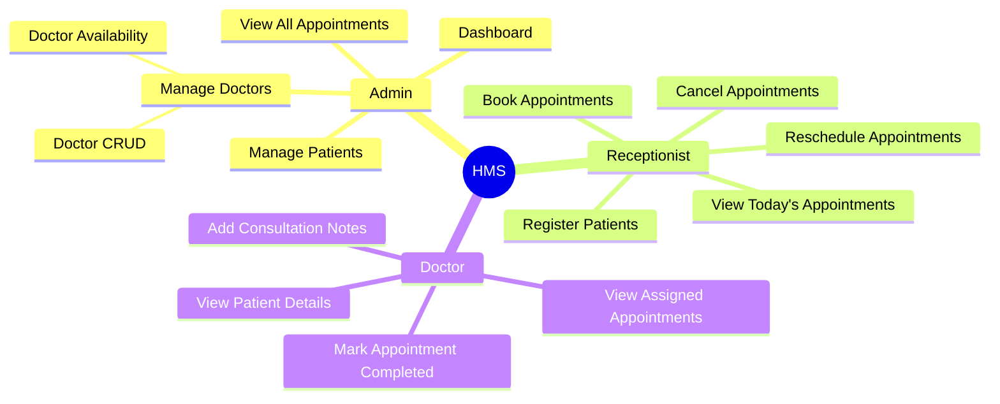
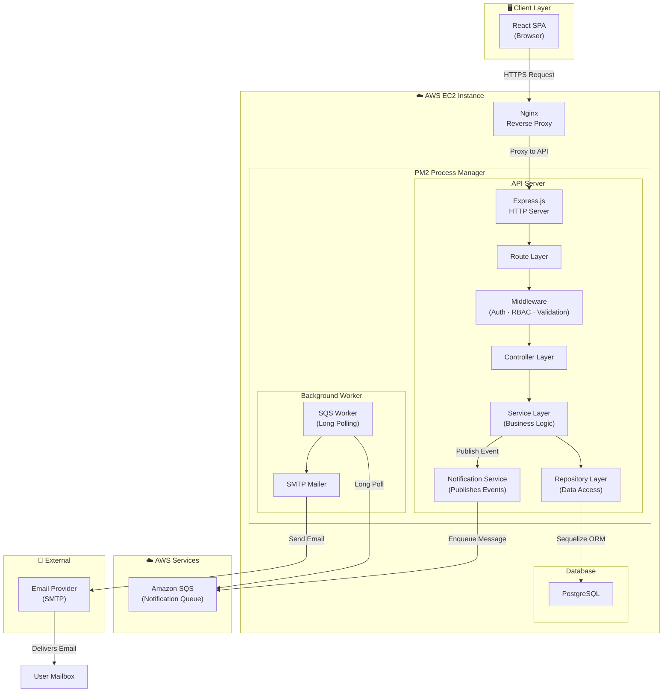
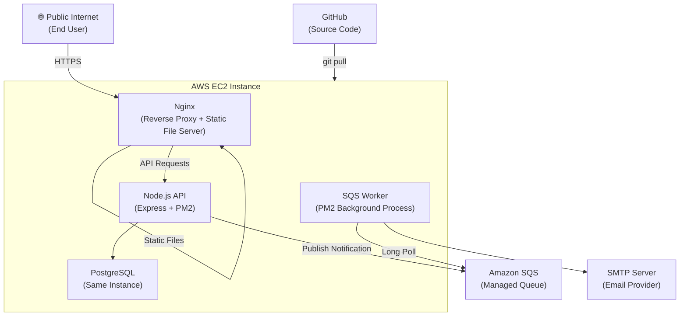
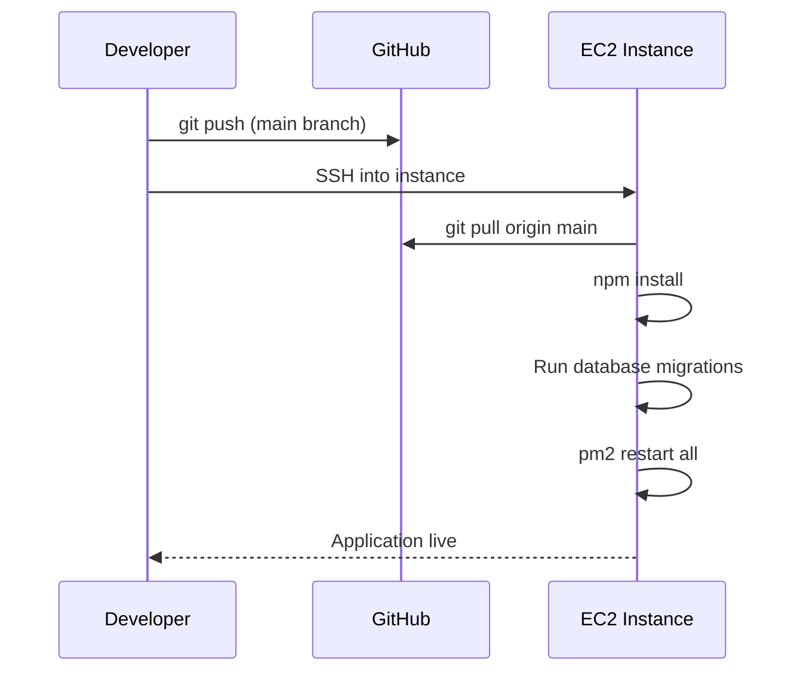
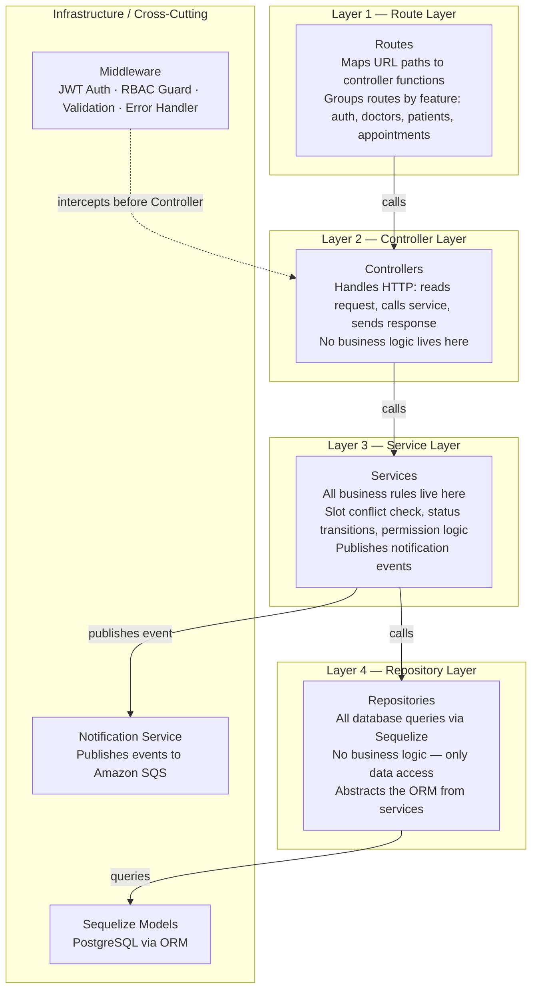
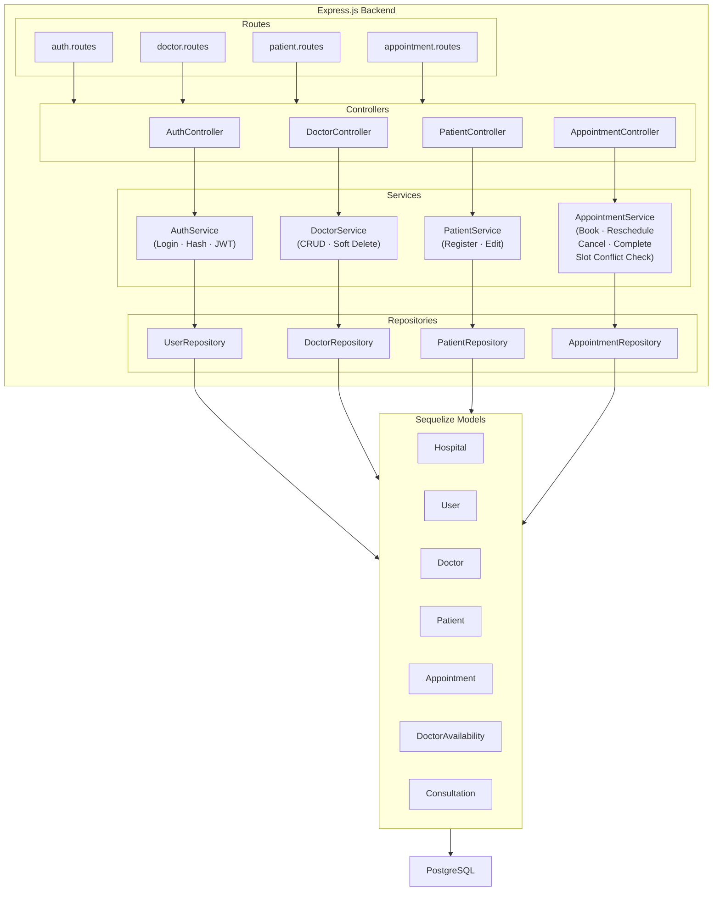
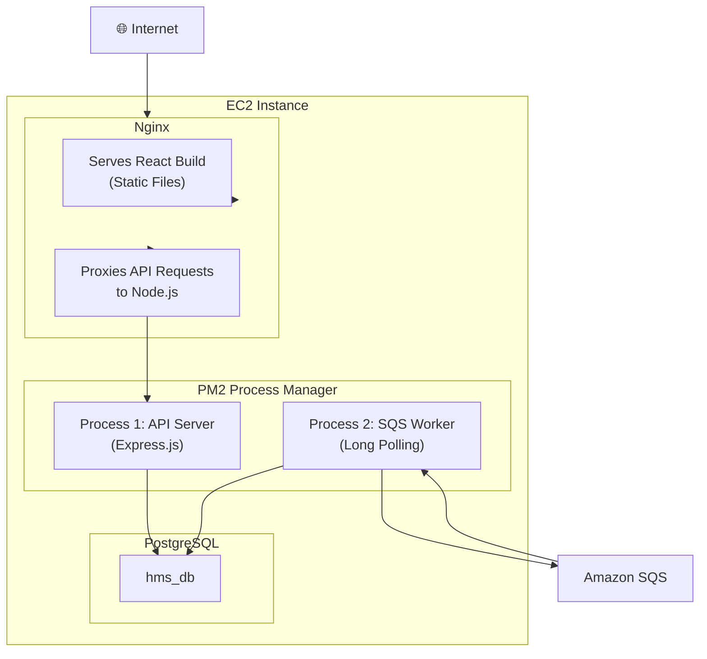
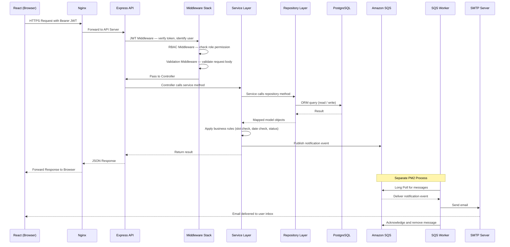
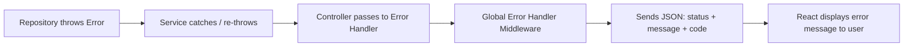
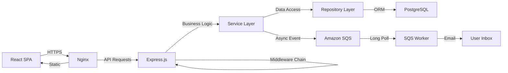

# Hospital Management System — Architecture Document

---

## 1. Executive Summary

The system serves three user roles — **Admin**, **Receptionist**, and **Doctor** — through a single monolithic web application backed by a RESTful Node.js API, a PostgreSQL database, and a lightweight notification pipeline using Amazon SQS and SMTP.

**Key Design Decisions at a Glance:**

| Decision | Choice | Reason |
|---|---|---|
| Architecture style | Layered Monolith | Simple, clean, easy to reason about |
| Backend runtime | Node.js + Express | Lightweight, fast, widely used |
| Database | PostgreSQL | Relational integrity, ACID compliance |
| ORM | Sequelize | Schema control with soft delete support |
| Authentication | JWT (stateless) | No session storage needed |
| Deployment | AWS EC2 + PM2 + Nginx | Practical, cost-effective for a single instance |
| Async Notifications | Amazon SQS + SMTP | Decoupled email/SMS without blocking the API |
| Future-readiness | Multi-hospital schema | One-to-many hospital support built into the data model |

---

## 2. Project Overview

### 2.1 What We Are Building

A **role-based web application** that allows hospital staff to manage doctors, patients, and appointments through a structured, permission-controlled interface.

### 2.2 Roles and Capabilities

### 2.3 Application Modules

The Hospital Management System is organized into the following functional modules. Each module encapsulates a specific business capability and exposes only the functionality relevant to the authorized user roles.

| Module | Description |
|---------|-------------|
| Authentication | Handles user login, logout, JWT authentication, and role-based access control. |
| Doctor Management | Allows the Admin to create, update, delete, and view doctor profiles. |
| Doctor Availability | Allows the Admin to define each doctor's working schedule, including available days, working hours, and slot duration. The system uses the configured working schedule to generate the available appointment time slots that Receptionists can book. |
| Patient Management | Allows Admins and Receptionists to register, update, and view patient records. |
| Appointment Management | Handles appointment booking, rescheduling, cancellation, and appointment history while enforcing scheduling business rules. |
| Consultation | Allows Doctors to view assigned appointments, add consultation notes, and mark appointments as completed. |
| Dashboard | Provides role-specific dashboards with operational summaries and statistics. |

### 2.4 Core Business Rules

- A doctor **cannot** have two appointments in the same time slot
- **Past dates** cannot be booked
- **Cancelled** appointments cannot be edited or rescheduled
- Every appointment carries a **status lifecycle**: `Scheduled → Completed | Cancelled`

---

## 3. High-Level System Architecture

This diagram shows every major system component and how they connect — from the user's browser all the way to the database and notification service.

### Why Each Component Exists

| Component | Why It's Here |
|---|---|
| **React SPA** | Decoupled frontend; communicates with the API over HTTPS. Runs entirely in the browser after initial load. |
| **Nginx** | Acts as the public-facing entry point. Handles SSL termination, serves the React build as static files, and proxies API requests to Express. The Node.js server is never exposed directly to the internet. |
| **Express.js** | Minimal, fast HTTP framework. Handles routing, middleware chaining, and JSON responses. |
| **PM2** | Process manager for Node.js. Keeps the Express server and the SQS worker alive, restarts them on crash, and manages logs. |
| **PostgreSQL** | ACID-compliant relational database. Enforces referential integrity between hospitals, doctors, patients, and appointments. |
| **Sequelize ORM** | Provides model definitions, migrations, associations, and built-in soft delete support. Avoids raw SQL for routine operations. |
| **Amazon SQS** | Decouples notification logic from the API. The API publishes an event and returns immediately — no waiting for emails to send. |
| **SQS Worker** | A separate Node.js process that listens on the queue continuously using long polling. Keeps notification processing isolated from the main API. |
| **SMTP Mailer** | Sends actual emails via a configured SMTP provider. Keeps email logic out of the main API process. |

---

## 4. AWS Architecture

The entire system runs on a **single EC2 instance**.

### AWS Component Rationale

| Component | Why Used |
|---|---|
| **EC2** | A general-purpose virtual server. Gives full control over the environment — Node.js, PostgreSQL, Nginx, and PM2 all run here.|
| **Amazon SQS** | A fully managed message queue. No infrastructure to configure or maintain. Decouples the API from the email-sending process, ensuring notifications do not slow down or break the main application. |
| **No Separate RDS** | PostgreSQL runs on the same EC2 instance. |

### Deployment Flow (Manual)

---

## 5. Backend Layered Architecture

The backend follows a **strict four-layer architecture** where each layer has one responsibility and only communicates with the layer directly below it.

### Layer Responsibilities

#### Route Layer
Defines the URL surface of the API. Each feature (auth, doctors, patients, appointments) has its own router file. Routes pass through middleware before reaching the controller. This layer contains **zero logic**.

#### Controller Layer
Reads the HTTP request, calls exactly one service method, and sends the HTTP response. Controllers are thin. They do not talk to the database or make decisions.

#### Service Layer

The heart of the application. Every business rule lives here:

- "Can this time slot be booked?" → **Slot conflict check**
- "Can this appointment be edited?" → **Status check (not cancelled)**
- "Is this date in the past?" → **Date validation**
- "Who is allowed to perform this action?" → **Role-specific guard**

Before creating or rescheduling an appointment, the Service Layer checks whether another active appointment already exists for the same doctor, date, and time slot. This provides immediate validation feedback to the user.

To guarantee data integrity, this rule is also enforced at the database level through a **unique constraint on `(doctor_id, appointment_date, time_slot)`**. This prevents duplicate bookings even if multiple requests are processed simultaneously.

After a successful operation, the service also decides whether to publish a notification event.

#### Repository Layer
The only layer that touches Sequelize models directly. Services request data through repository methods. This layer is easy to test in isolation and easy to swap if the ORM ever changes.

#### Middleware (Cross-Cutting)
Middleware runs before every protected route:
- **JWT Auth Middleware** — verifies the token and identifies the requesting user
- **RBAC Guard** — confirms the user's role has permission to access the route
- **Validation Middleware** — validates the request body against a defined schema
- **Global Error Handler** — catches all thrown errors and returns a consistent JSON response

---

## 6. Component Diagram

This diagram shows the backend layer chain — how a request flows from the Route layer through to the database.

---

## 7. Deployment Architecture

### What Runs on the EC2 Instance

### PM2 Process Table

| Process | Role |
|---|---|
| `hms-api` | Express API Server — handles all incoming HTTP requests |
| `hms-worker` | SQS Long Polling Worker — consumes notification events and sends emails |

---

## 8. Component Communication

This section describes exactly how every component in the system talks to every other component.

### 8.1 Communication Flow Map

### 8.2 Channel-by-Channel Breakdown

---

#### React → Nginx
**Channel:** HTTPS
**How:** The React app sends API requests over HTTPS with a Bearer token attached to the Authorization header. Nginx is the only component the browser communicates with directly.

---

#### Nginx → Express
**Channel:** Internal network (same instance)
**How:** Nginx receives all incoming requests. It serves the React build as static files for browser navigation, and forwards all API requests to the Node.js server running on the same instance. The Node.js server is never accessible from the internet directly.

---

#### Express → Middleware Stack
**Channel:** Internal function calls (in-process)
**How:** Every request passes through the middleware chain in order before reaching the controller:
1. **JWT Middleware** — decodes and verifies the token; attaches the user identity to the request
2. **RBAC Guard** — checks whether the user's role has permission for that route; returns 403 if not
3. **Validation Middleware** — validates the request body against the expected schema; returns 400 with field errors if invalid
4. The controller is called only if all middleware passes

---

#### Controller → Service
**Channel:** Internal function calls (in-process)
**How:** The controller reads the request, calls exactly one service method, and sends the response. It does not apply any business logic. It is the bridge between the HTTP layer and the application logic.

---

#### Service → Repository
**Channel:** Internal function calls (in-process)
**How:** The service layer calls named repository methods to read or write data. It never writes database queries directly. This keeps business logic separate from data access and makes both easier to test independently.

---

#### Repository → PostgreSQL
**Channel:** Internal connection via Sequelize ORM
**How:** Sequelize models map to database tables. The repository calls model methods, which Sequelize translates into SQL queries. A connection pool manages concurrent database access efficiently. The database is only accessible within the instance — it is not reachable from the internet.

---

#### Service → Amazon SQS (Notification Publishing)
**Channel:** Outbound HTTPS to AWS
**How:** After a successful booking, reschedule, or cancellation, the Service calls the Notification Service, which publishes an event message to the SQS queue. The API returns its response to the client immediately. It does not wait for the email to be sent. Notifications are fully decoupled from the main request lifecycle.

---

#### SQS Worker → Amazon SQS (Long Polling)
**Channel:** Outbound HTTPS to AWS
**How:** The worker runs as a separate PM2 process. It continuously polls the SQS queue using long polling — SQS holds the connection open and returns as soon as a message is available, rather than requiring the worker to repeatedly check. This reduces unnecessary network calls and delivers messages promptly.

---

#### SQS Worker → SMTP Server
**Channel:** SMTP (outbound to email provider)
**How:** When the worker receives a notification event from SQS, it reads the event type and recipient details, constructs the appropriate email, and sends it via the configured SMTP provider. Once the email is sent, the worker acknowledges the message to remove it from the queue.

---

### 8.3 Error Propagation Path

All unhandled errors bubble up to a single Global Error Handler middleware. This handler normalises all errors into a consistent JSON response shape, so the frontend always receives a predictable error structure regardless of where the failure occurred.

---

## Summary

