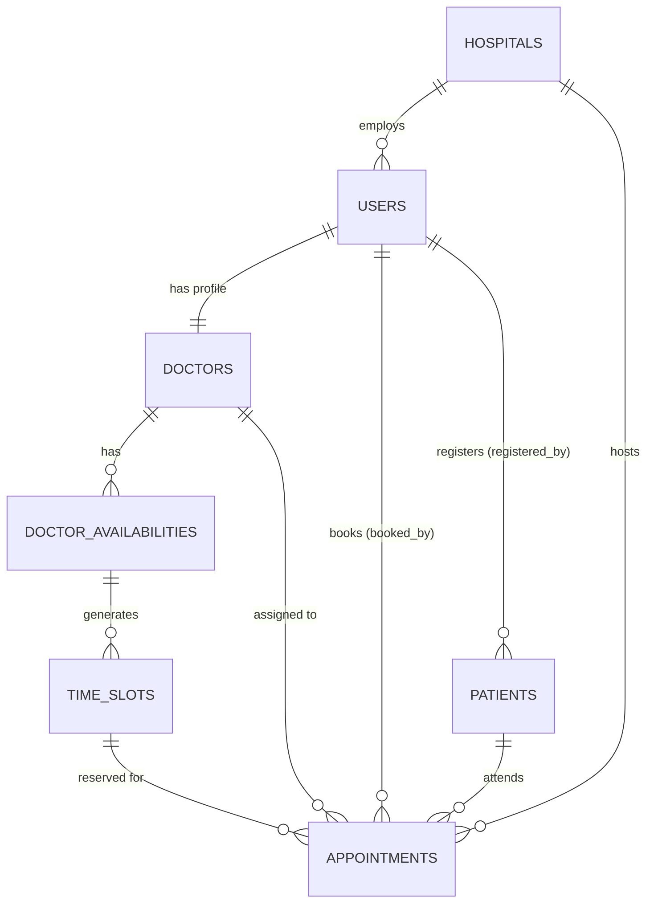
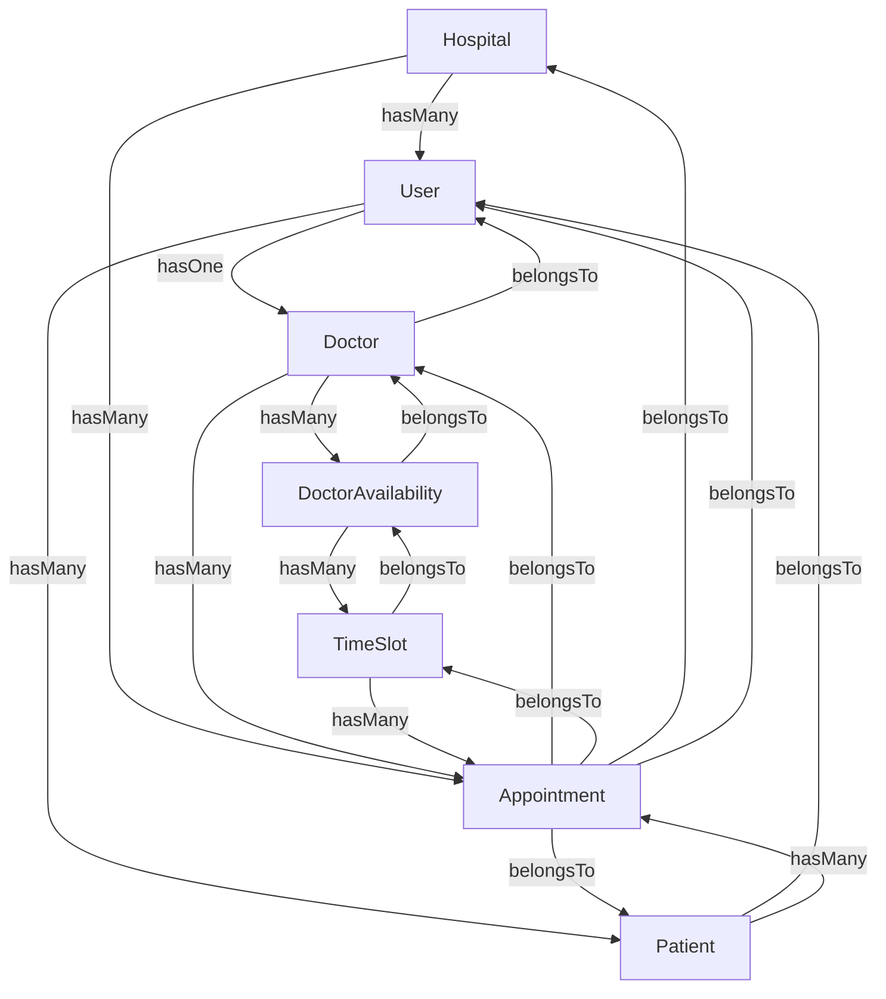
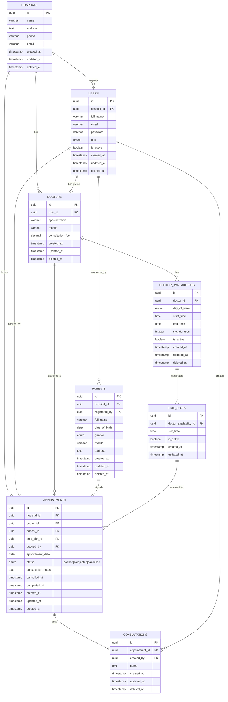

# Hospital Management System — Database Design

---

## 1. Overview

**Database:** PostgreSQL  
**ORM:** Sequelize  

### Tables at a Glance

| # | Table | Purpose |
|---|---|---|
| 1 | `hospitals` | Stores hospital records. Supports future multi-hospital expansion. |
| 2 | `users` | Stores login credentials and role for all system users (Admin, Receptionist, Doctor). |
| 3 | `doctors` | Stores professional profile details for Doctor users. |
| 4 | `patients` | Stores patient registration details. |
| 5 | `doctor_availabilities` | Defines which days of the week a doctor is available. |
| 6 | `time_slots` | Defines the specific time slots within a doctor's availability window. |
| 7 | `appointments` | Records every appointment booking between a doctor and a patient. |
| 8 | `consultations` | Stores consultation notes added by doctors after patient consultation. |


---

## 3. Table Definitions

---

### 3.1 `hospitals`

**Purpose:**  
The `hospitals` table is the root of the schema. Every user, patient, and appointment is directly associated with a hospital. Doctor profiles inherit their hospital association through the related User record (`users.hospital_id`) rather than storing a separate hospital reference. Although the current implementation is intended for a single hospital, the schema is designed to support multiple hospitals in the future without structural changes.

| Column | Data Type | Nullable | Default | Constraint |
|---|---|---|---|---|
| `id` | `UUID` | NOT NULL | `gen_random_uuid()` | PRIMARY KEY |
| `name` | `VARCHAR(150)` | NOT NULL | — | UNIQUE |
| `address` | `TEXT` | NOT NULL | — | — |
| `phone` | `VARCHAR(20)` | NOT NULL | — | — |
| `email` | `VARCHAR(150)` | NOT NULL | — | UNIQUE |
| `created_at` | `TIMESTAMP` | NOT NULL | `NOW()` | — |
| `updated_at` | `TIMESTAMP` | NOT NULL | `NOW()` | — |
| `deleted_at` | `TIMESTAMP` | NULL | `NULL` | Soft Delete |

---

### 3.2 `users`

**Purpose:**  
The `users` table handles all authentication and role assignment. Every person who logs into the system — Admin, Receptionist, or Doctor — has a record here. This table stores credentials and role only, not professional or personal profile details.

| Column | Data Type | Nullable | Default | Constraint |
|---|---|---|---|---|
| `id` | `UUID` | NOT NULL | `gen_random_uuid()` | PRIMARY KEY |
| `hospital_id` | `UUID` | NOT NULL | — | FOREIGN KEY → `hospitals.id` |
| `full_name` | `VARCHAR(100)` | NOT NULL | — | — |
| `email` | `VARCHAR(150)` | NOT NULL | — | UNIQUE |
| `password` | `VARCHAR(255)` | NOT NULL | — | — |
| `role` | `ENUM('admin', 'receptionist', 'doctor')` | NOT NULL | — | — |
| `is_active` | `BOOLEAN` | NOT NULL | `TRUE` | — |
| `created_at` | `TIMESTAMP` | NOT NULL | `NOW()` | — |
| `updated_at` | `TIMESTAMP` | NOT NULL | `NOW()` | — |
| `deleted_at` | `TIMESTAMP` | NULL | `NULL` | Soft Delete |


---

### 3.3 `doctors`

**Purpose:**  
The `doctors` table stores the professional profile of a doctor. It extends the `users` table via a one-to-one relationship. A doctor user has a login identity in `users` and professional details here. This separation keeps authentication concerns in one place and domain data in another.
A doctor's hospital is derived through the associated User record rather than being stored directly in the Doctor table.

| Column | Data Type | Nullable | Default | Constraint |
|---|---|---|---|---|
| `id` | `UUID` | NOT NULL | `gen_random_uuid()` | PRIMARY KEY |
| `user_id` | `UUID` | NOT NULL | — | FOREIGN KEY → `users.id`, UNIQUE |
| `specialization` | `VARCHAR(100)` | NOT NULL | — | — |
| `mobile` | `VARCHAR(20)` | NOT NULL | — | — |
| `consultation_fee` | `DECIMAL(10, 2)` | NOT NULL | — | — |
| `created_at` | `TIMESTAMP` | NOT NULL | `NOW()` | — |
| `updated_at` | `TIMESTAMP` | NOT NULL | `NOW()` | — |
| `deleted_at` | `TIMESTAMP` | NULL | `NULL` | Soft Delete |

**Column Rationale:**

| Column | Why It Exists |
|---|---|
| `id` | UUID primary key for the doctor profile record. |
| `user_id` | Links this doctor profile to a user account. The UNIQUE constraint ensures one doctor profile per user — a one-to-one relationship. |
| `consultation_fee` | The fee charged per appointment. DECIMAL(10,2) ensures precision for monetary values — no floating-point rounding errors. |


---

### 3.4 `patients`

**Purpose:**  
The `patients` table stores the registration details of every patient. Patients do not log in—they are managed by Receptionists. Each patient record stores the User (`registered_by`) who registered it, allowing the patient's hospital to be derived through the associated User (`users.hospital_id`) without storing a separate hospital reference.

| Column | Data Type | Nullable | Default | Constraint |
|---|---|---|---|---|
| `id` | `UUID` | NOT NULL | `gen_random_uuid()` | PRIMARY KEY |
| `registered_by` | `UUID` | NOT NULL | — | FOREIGN KEY → `users.id` |
| `full_name` | `VARCHAR(100)` | NOT NULL | — | — |
| `email` | `VARCHAR(150)` | NOT NULL | — | UNIQUE |
| `date_of_birth` | `DATE` | NOT NULL | — | — |
| `gender` | `ENUM('male', 'female', 'other')` | NOT NULL | — | — |
| `mobile` | `VARCHAR(20)` | NOT NULL | — | — |
| `address` | `TEXT` | NULL | `NULL` | — |

**Column Rationale:**

| Column | Why It Exists |
|---|---|
| `id` | UUID primary key for the patient record. |
| `registered_by` | Foreign key to `users`. Records which Receptionist registered this patient — important for accountability. |

---

### 3.5 `doctor_availabilities`

**Purpose:**  
The `doctor_availabilities` table defines a doctor's weekly working schedule. Each record represents one availability window for a specific day of the week, including the start time, end time, and slot duration. Whenever an availability record is created or updated, the system automatically generates the corresponding appointment time slots. Receptionists can only book appointments using these generated slots, ensuring consistent scheduling and preventing invalid appointment times.

| Column | Data Type | Nullable | Default | Constraint |
|---|---|---|---|---|
| `id` | `UUID` | NOT NULL | `gen_random_uuid()` | PRIMARY KEY |
| `doctor_id` | `UUID` | NOT NULL | — | FOREIGN KEY → `doctors.id` |
| `day_of_week` | `ENUM('monday','tuesday','wednesday','thursday','friday','saturday','sunday')` | NOT NULL | — | — |
| `start_time` | `TIME` | NOT NULL | — | — |
| `end_time` | `TIME` | NOT NULL | — | — |
| `slot_duration` | `INTEGER` | NOT NULL | — | — |
| `is_active` | `BOOLEAN` | NOT NULL | `TRUE` | — |
| `created_at` | `TIMESTAMP` | NOT NULL | `NOW()` | — |
| `updated_at` | `TIMESTAMP` | NOT NULL | `NOW()` | — |
| `deleted_at` | `TIMESTAMP` | NULL | `NULL` | Soft Delete |

**Unique Constraint:** `(doctor_id, day_of_week)` — A doctor cannot have two availability windows for the same day.

**Column Rationale:**

| Column | Why It Exists |
|---|---|
| `start_time` | The time the doctor begins consultations on this day (e.g., 09:00). |
| `end_time` | The time the doctor ends consultations on this day (e.g., 13:00). |
| `slot_duration` | Determines the duration of each appointment slot and is used to automatically generate bookable time slots from the availability window. Different doctors can have different slot durations without requiring any schema changes. |
| `is_active` | Allows a doctor's availability for a specific day to be temporarily disabled without deleting the record (e.g., doctor is on leave). |

---

### 3.6 `time_slots`

**Purpose:**  
The `time_slots` table stores the specific, bookable time slots within a doctor's availability window. Slots are generated from the availability's `start_time`, `end_time`, and `slot_duration`. For example: `start_time = 09:00`, `end_time = 11:00`, `slot_duration = 30` produces 09:00, 09:30, 10:00, 10:30. Appointments are booked against a specific time slot — this is the mechanism that prevents double-booking.

| Column | Data Type | Nullable | Default | Constraint |
|---|---|---|---|---|
| `id` | `UUID` | NOT NULL | `gen_random_uuid()` | PRIMARY KEY |
| `doctor_availability_id` | `UUID` | NOT NULL | — | FOREIGN KEY → `doctor_availabilities.id` |
| `slot_time` | `TIME` | NOT NULL | — | — |
| `is_active` | `BOOLEAN` | NOT NULL | `TRUE` | — |
| `created_at` | `TIMESTAMP` | NOT NULL | `NOW()` | — |
| `updated_at` | `TIMESTAMP` | NOT NULL | `NOW()` | — |

**Unique Constraint:** `(doctor_availability_id, slot_time)` — A doctor cannot have two identical time slots within the same availability window.

> **No soft delete on `time_slots`:** Time slots are a configuration resource. They are not transactional data. If a time slot is deactivated (`is_active = FALSE`), it simply becomes unbookable. Historical appointments already reference the slot by `time_slot_id` and are unaffected.

**Column Rationale:**

| Column | Why It Exists |
|---|---|
| `id` | UUID primary key. Referenced by the `appointments` table as the booking anchor. |
| `doctor_availability_id` | Links this slot to a specific doctor's availability window on a specific day. |
| `slot_time` | The exact time of the slot (e.g., 09:30). TIME type stores hours and minutes without a date component, keeping the slot reusable across different appointment dates. |
| `is_active` | Allows a specific slot to be disabled (e.g., doctor's lunch break) without deleting it. Deactivated slots cannot be booked. |
| `created_at / updated_at` | Standard timestamps to track when slots were created or modified. |

---

### 3.7 `appointments`

**Purpose:**  
The `appointments` table is the operational heart of the system. It records every booking made between a patient and a doctor for a specific date and time slot. It also tracks the appointment's lifecycle (status), who booked it, and any consultation notes added by the doctor.

| Column | Data Type | Nullable | Default | Constraint |
|---|---|---|---|---|
| `id` | `UUID` | NOT NULL | `gen_random_uuid()` | PRIMARY KEY |
| `hospital_id` | `UUID` | NOT NULL | — | FOREIGN KEY → `hospitals.id` |
| `doctor_id` | `UUID` | NOT NULL | — | FOREIGN KEY → `doctors.id` |
| `patient_id` | `UUID` | NOT NULL | — | FOREIGN KEY → `patients.id` |
| `time_slot_id` | `UUID` | NOT NULL | — | FOREIGN KEY → `time_slots.id` |
| `appointment_date` | `DATE` | NOT NULL | — | — |
| `status` | `ENUM('booked', 'completed', 'cancelled')` | NOT NULL | `'booked'` | — |
| `booked_by` | `UUID` | NOT NULL | — | FOREIGN KEY → `users.id` |
| `consultation_notes` | `TEXT` | NULL | `NULL` | — |
| `cancelled_at` | `TIMESTAMP` | NULL | `NULL` | — |
| `completed_at` | `TIMESTAMP` | NULL | `NULL` | — |
| `created_at` | `TIMESTAMP` | NOT NULL | `NOW()` | — |
| `updated_at` | `TIMESTAMP` | NOT NULL | `NOW()` | — |
| `deleted_at` | `TIMESTAMP` | NULL | `NULL` | Soft Delete |

**Unique Constraint:** `(doctor_id, appointment_date, time_slot_id)` — A doctor cannot have two appointments for the same date and time slot. This is the database-level enforcement of the core booking business rule.

**Column Rationale:**

| Column | Why It Exists |
|---|---|
| `id` | UUID primary key for the appointment record. |
| `time_slot_id` | The specific time slot booked. Together with `doctor_id` and `appointment_date`, this forms the unique booking key. |
| `status` | Tracks the appointment's current state. ENUM restricts to the three valid states defined in the BRD: `booked`, `completed`, `cancelled`. Defaults to `booked` when an appointment is created. |
| `booked_by` | The Receptionist (or Admin) who created this booking. Required for accountability and audit. |
| `consultation_notes` | Notes added by the Doctor after or during the consultation. Nullable — only populated when the doctor marks the appointment completed. |

---
### 3.8 `consultations`

**Purpose:**  
The `consultations` table stores the clinical notes recorded by a doctor after a patient's consultation. Each consultation is linked to exactly one appointment, ensuring a one-to-one relationship between an appointment and its consultation record.

| Column | Data Type | Nullable | Default | Constraint |
|---|---|---|---|---|
| `id` | `UUID` | NOT NULL | `gen_random_uuid()` | PRIMARY KEY |
| `appointment_id` | `UUID` | NOT NULL | — | FOREIGN KEY → `appointments.id`, UNIQUE |
| `notes` | `TEXT` | NOT NULL | — | — |
| `created_by` | `UUID` | NOT NULL | — | FOREIGN KEY → `users.id` |
| `created_at` | `TIMESTAMP` | NOT NULL | `NOW()` | — |
| `updated_at` | `TIMESTAMP` | NOT NULL | `NOW()` | — |
| `deleted_at` | `TIMESTAMP` | NULL | `NULL` | Soft Delete |

**Column Rationale:**

| Column | Why It Exists |
|---|---|
| `appointment_id` | Ensures one consultation record exists for each appointment. |
| `created_by` | Records which doctor created the consultation for audit purposes. |
| `deleted_at` | Enables soft delete while preserving historical consultation records. |

---


## 4. Database Relationships

### 4.1 Relationship Overview



---

### 4.2 Relationship Explanations

#### Hospital → Users `(One-to-Many)`
One hospital employs many users (Admins, Receptionists, and Doctors). Each user belongs to exactly one hospital.  
`hospitals.id` ← `users.hospital_id`

---

#### Hospital → Doctor (Indirect Relationship)

Doctors belong to a hospital through their associated User account.

Hospital
    ->
Users
    ->
Doctors

This avoids storing the same hospital reference twice while preserving the rule that every doctor belongs to exactly one hospital.

---

#### Hospital → Patients (Indirect Relationship)

Patients are associated with a hospital through the User who registered them.

```text
Hospital
    ↓
Users
    ↓
Patients
```

This avoids storing a redundant `hospital_id` in the `patients` table while still allowing hospital-specific patient queries through the associated User.

---

#### Hospital → Appointments `(One-to-Many)`
One hospital hosts many appointments. This allows the Admin dashboard to query all appointments within a hospital.  
`hospitals.id` ← `appointments.hospital_id`

---

#### User → Doctor `(One-to-One)`
One user account can have exactly one doctor profile. The `user_id` column in `doctors` is UNIQUE, enforcing this one-to-one relationship.  
A doctor without a user account cannot exist — they must be able to log in.  
`users.id` ← `doctors.user_id` (UNIQUE)

---

#### User → Appointments `(One-to-Many, via booked_by)`
One receptionist (user) can book many appointments. Each appointment records which user booked it.  
`users.id` ← `appointments.booked_by`

---

#### User → Patients `(One-to-Many, via registered_by)`
One receptionist (user) can register many patients. Each patient records which user registered them.  
`users.id` ← `patients.registered_by`

---

#### Doctor → DoctorAvailability `(One-to-Many)`
One doctor can have multiple availability windows — one per day of the week they work.  
`doctors.id` ← `doctor_availabilities.doctor_id`

---

#### DoctorAvailability → TimeSlots `(One-to-Many)`
One availability window contains many time slots. For example, a Monday window from 09:00–11:00 generates slots at 09:00, 09:30, 10:00, 10:30.  
`doctor_availabilities.id` ← `time_slots.doctor_availability_id`

---

#### Doctor → Appointments `(One-to-Many)`
One doctor can have many appointments across many dates.  
`doctors.id` ← `appointments.doctor_id`

---

#### Patient → Appointments `(One-to-Many)`
One patient can attend many appointments over time.  
`patients.id` ← `appointments.patient_id`

---

#### TimeSlot → Appointments `(One-to-Many)`
One time slot can appear in multiple appointments — but only on different dates (enforced by the unique constraint). The same 10:00 slot on Monday can be booked for different patients on different Mondays.  
`time_slots.id` ← `appointments.time_slot_id`

#### Appointment → Consultation (One-to-One)

Each appointment can have exactly one consultation record. The unique constraint on appointment_id enforces this relationship.

#### User → Consultation (One-to-Many)

A doctor (user) can create many consultation records. Each consultation stores the doctor who authored it using created_by.

---

## 5. Business Rule Enforcement


### 5.1 Future Support for Multiple Hospitals

**Database Design Enforcement:**  
The schema is designed to support multiple hospitals without structural changes. Hospital ownership is maintained either directly or indirectly:

- `users` and `appointments` store a direct `hospital_id` reference.
- Patients inherit their hospital association through the User who registered them (`registered_by → users.hospital_id`).
- Doctors inherit their hospital association through their associated User record (`user_id → users.hospital_id`).
- This design avoids redundant data while ensuring every business entity belongs to exactly one hospital.

When the application is extended to support multiple hospitals, all hospital-scoped queries can be implemented without modifying the database schema.
---

### 5.2 Soft Deletes

**Database Enforcement:**  
The `deleted_at` column exists on all tables where records should never be permanently removed. Sequelize's `paranoid: true` mode automatically filters out records where `deleted_at IS NOT NULL` in all standard queries. Hard delete is blocked by design.

---

## 6. Sequelize Association Design

This section describes which associations will be defined in Sequelize and why each one is needed.

---

### 6.1 Association Map



---

### 6.2 Association Rationale

| Association | Reasoning |
|---|---|
| `Hospital.hasMany(User)` | Allows querying all users in a hospital. Supports future multi-hospital user management. |
| `User.belongsTo(Hospital)` | Every user knows which hospital they belong to. Required for RBAC scoping. |
| `User.hasOne(Doctor)` | Allows loading a doctor's professional profile from their user account. Used when the doctor logs in and their profile data is needed. |
| `Doctor.belongsTo(User)` | Allows the Doctor record to include the user's name and email through a JOIN — avoids duplicating those fields in the doctors table. |
| `Doctor.hasMany(DoctorAvailability)` | Allows fetching all working days for a doctor. Used when displaying the booking calendar. |
| `DoctorAvailability.belongsTo(Doctor)` | Allows the availability record to resolve its parent doctor. |
| `DoctorAvailability.hasMany(TimeSlot)` | Allows fetching all slots within a working window. Used when presenting available times for booking. |
| `TimeSlot.belongsTo(DoctorAvailability)` | Allows a slot to resolve its parent availability and, through it, the doctor. |
| `Doctor.hasMany(Appointment)` | Allows fetching all appointments assigned to a doctor. Used for the Doctor dashboard and schedule view. |
| `Patient.hasMany(Appointment)` | Allows fetching all appointments for a patient. Used for appointment history. |
| `Appointment.belongsTo(Doctor)` | Required to include doctor name and specialization when displaying an appointment. |
| `Appointment.belongsTo(Patient)` | Required to include patient name and details when displaying an appointment. |
| `Appointment.belongsTo(TimeSlot)` | Required to display the booked time on an appointment card. |
| `Appointment.belongsTo(Hospital)` | Required for hospital-level appointment reports on the Admin dashboard. |
| `Appointment.belongsTo(User, { as: 'bookedBy' })` | Required to display which receptionist created the booking. The alias distinguishes this from the doctor/patient user associations. |

---

## 7. Index Strategy

Indexes are created only where query performance justifiably requires them. Over-indexing adds write overhead with no benefit for a system of this scale.

| Index | Table | Columns | Type | Reason |
|---|---|---|---|---|
| `idx_users_email` | `users` | `email` | UNIQUE | Login lookup by email on every authentication request. |
| `idx_users_hospital_id` | `users` | `hospital_id` | Standard | Fetch all users in a hospital (Admin management screen). |
| `idx_doctors_user_id` | `doctors` | `user_id` | UNIQUE | One-to-one join from User to Doctor profile. High-frequency lookup at login. |
| `idx_patients_mobile` | `patients` | `mobile` | Standard | Receptionist searches for a patient by phone number before booking. |
| `idx_appointments_booking_key` | `appointments` | `(doctor_id, appointment_date, time_slot_id)` | UNIQUE | The slot conflict check. This index is also the unique constraint — it prevents double-booking at the database level and accelerates the availability query. |
| `idx_appointments_doctor_date` | `appointments` | `(doctor_id, appointment_date)` | Standard | Fetch a doctor's schedule for a specific date (Doctor dashboard: Today's Schedule). |
| `idx_appointments_patient_id` | `appointments` | `patient_id` | Standard | Fetch all appointments for a patient (Appointment History). |
| `idx_appointments_hospital_date` | `appointments` | `(hospital_id, appointment_date)` | Standard | Admin dashboard: Today's Appointments across the hospital. |
| `idx_availability_doctor_day` | `doctor_availabilities` | `(doctor_id, day_of_week)` | UNIQUE | Enforce one availability window per doctor per day. Also used when loading the booking calendar. |
| `idx_timeslots_availability_id` | `time_slots` | `doctor_availability_id` | Standard | Fetch all slots for a given availability window during booking. |

---

## 8. ER Diagram

### 8.1 Entity-Relationship Diagram



---

## 9. Soft Delete

### Which Tables Use Soft Delete

| Table | Soft Delete | Reason |
|---|---|---|
| `hospitals` | ✅ Yes | Hospital records carry historical data for all entities beneath them. |
| `users` | ✅ Yes | Deactivated users must retain their history (appointments booked, patients registered). |
| `doctors` | ✅ Yes | Deleted doctors still appear in historical appointment records. |
| `patients` | ✅ Yes | Patient records must be preserved for appointment history and compliance. |
| `doctor_availabilities` | ✅ Yes | Preserves the context under which time slots were generated. |
| `time_slots` | ❌ No | Time slots are configuration data. `is_active = FALSE` is sufficient. No transactional history depends on the slot record itself. |
| `appointments` | ✅ Yes | Appointment records are never deleted. Cancellation is a status change, not a deletion. |

---


