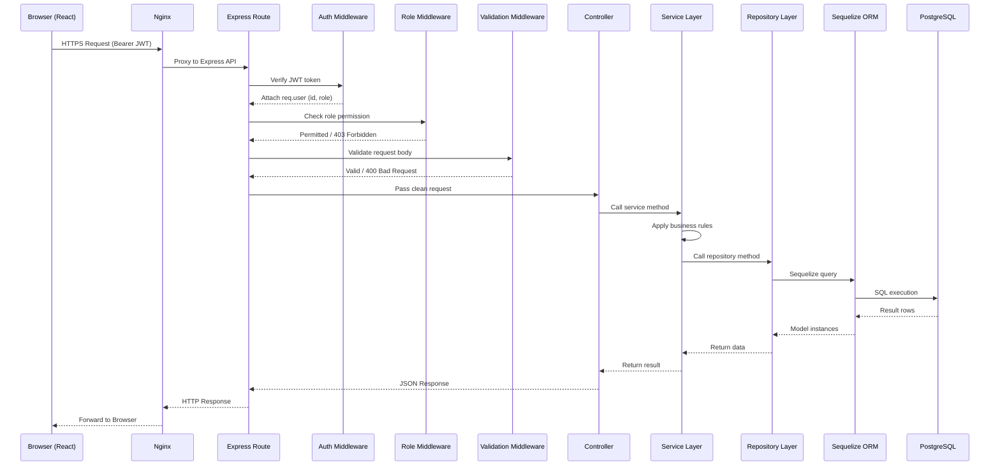
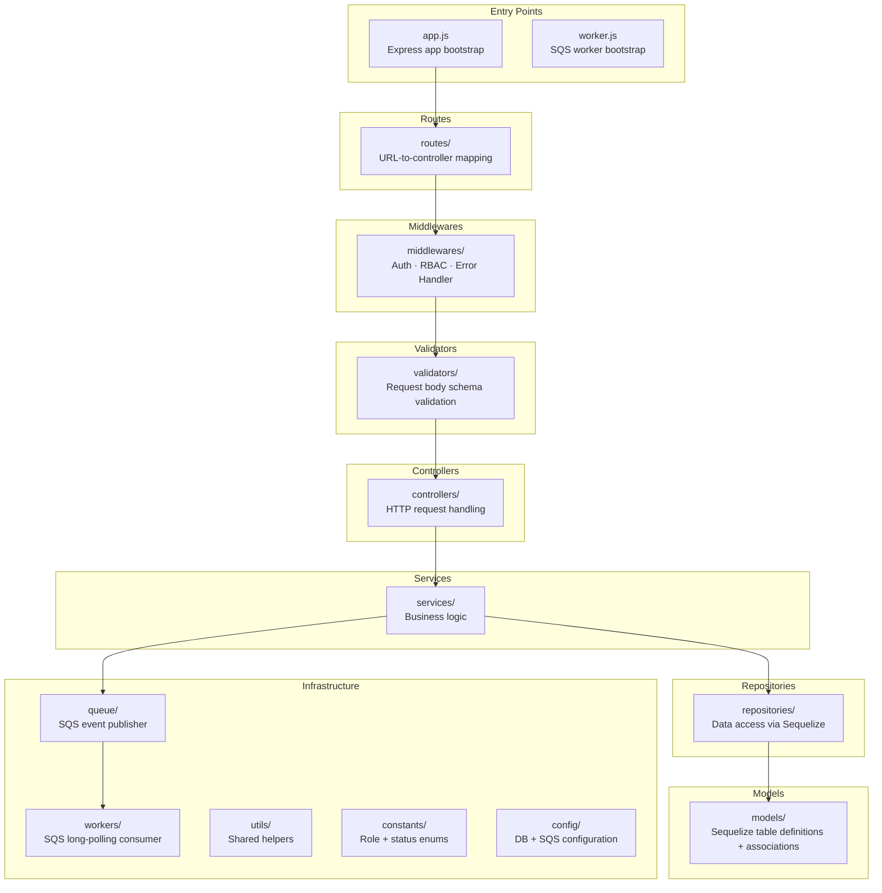
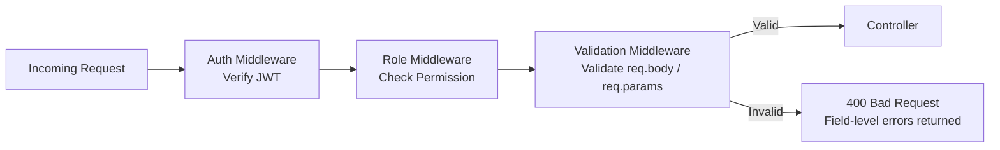

## Hospital Management System — API Design & Backend Structure
---


## Base URL

```
/api/v1
```

## Authentication

All protected APIs require the following header:

```
Authorization: Bearer <JWT_TOKEN>
```

---

# 1. Authentication Module

| Method | Endpoint | Access | Purpose |
|---------|----------|--------|---------|
| POST | `/api/v1/auth/login` | Public | Authenticate user and generate JWT token |
| POST | `/api/v1/auth/logout` | Admin, Receptionist, Doctor | Logout authenticated user |
| POST | `/api/v1/auth/forgot-password` | Public | Send password reset link |

---

# 2. Doctor Management Module

| Method | Endpoint | Access | Purpose |
|---------|----------|--------|---------|
| POST | `/api/v1/admin/doctors` | Admin | Create a new doctor |
| GET | `/api/v1/admin/doctors` | Admin | Retrieve all doctors |
| GET | `/api/v1/admin/doctors/:id` | Admin, Doctor (Own Profile) | Retrieve doctor details |
| PUT | `/api/v1/admin/doctors/:id` | Admin | Update doctor information |
| DELETE | `/api/v1/admin/doctors/:id` | Admin | Soft delete doctor |

---

# 3. Doctor Availability Module

| Method | Endpoint | Access | Purpose |
|---------|----------|--------|---------|
| POST | `/api/v1/admin/doctors/:id/availability` | Admin | Create doctor availability |
| GET | `/api/v1/admin/doctors/:id/availability` | Admin | Retrieve doctor availability |
| PUT | `/api/v1/admin/availability/:id` | Admin | Update availability schedule |
| DELETE | `/api/v1/admin/availability/:id` | Admin | Delete availability schedule |
| GET | `/api/v1/admin/doctors/:id/available-slots` | Admin, Receptionist | Retrieve available appointment slots |

---

# 4. Patient Management Module

| Method | Endpoint | Access | Purpose |
|---------|----------|--------|---------|
| POST | `/api/v1/patients` | Admin, Receptionist | Register a patient |
| GET | `/api/v1/patients` | Admin, Receptionist | Retrieve all patients |
| GET | `/api/v1/patients/:id` | Admin, Receptionist, Doctor | Retrieve patient details |
| PUT | `/api/v1/patients/:id` | Admin, Receptionist | Update patient information |

---

# 5. Appointment Management Module

| Method | Endpoint | Access | Purpose |
|---------|----------|--------|---------|
| POST | `/api/v1/appointments` | Admin, Receptionist | Book an appointment |
| PUT | `/api/v1/appointments/:id/reschedule` | Admin, Receptionist | Reschedule an appointment |
| PUT | `/api/v1/appointments/:id/cancel` | Admin, Receptionist | Cancel an appointment |
| GET | `/api/v1/appointments` | Admin, Receptionist | Retrieve appointment history |
| GET | `/api/v1/appointments/today` | Admin, Receptionist | Retrieve today's appointments |
| GET | `/api/v1/appointments/schedule` | Admin, Doctor | Retrieve doctor's schedule |

---

# 6. Consultation Module

| Method | Endpoint | Access | Purpose |
|---------|----------|--------|---------|
| PUT | `/api/v1/appointments/:id/notes` | Doctor | Add or update consultation notes |
| PUT | `/api/v1/appointments/:id/complete` | Doctor | Mark appointment as completed |

---

# 7. Dashboard Module

| Method | Endpoint | Access | Purpose |
|---------|----------|--------|---------|
| GET | `/api/v1/dashboard/admin` | Admin | Retrieve admin dashboard metrics |
| GET | `/api/v1/dashboard/receptionist` | Receptionist | Retrieve receptionist dashboard metrics |
| GET | `/api/v1/dashboard/doctor` | Doctor | Retrieve doctor dashboard metrics |


---

# 8. Standard API Response

### Success Response

```json
{
  "success": true,
  "message": "Operation completed successfully",
  "data": {},
  "timestamp": "2026-06-30T10:00:00.000Z"
}
```

### Error Response

```json
{
  "success": false,
  "message": "Operation failed",
  "errors": [
    {
      "field": "email",
      "message": "Email is required"
    }
  ],
  "timestamp": "2026-06-30T10:00:00.000Z"
}
```


---

## 9. Request Flow

This diagram shows the complete lifecycle of an authenticated API request from the browser to the database and back.




---


## 10. Responsibility of Each Layer



---

## 11. Request Validation Strategy

### Where Validation Happens

All request validation occurs in the **Validator Middleware layer** — after the auth and role middlewares and **before** the request reaches the controller.




---

## 12. Role-Based Access Control Matrix

This matrix defines exactly which actions each role can perform, derived directly from the BRD.

| Feature | Admin | Receptionist | Doctor |
|---|:---:|:---:|:---:|
| **Authentication** | | | |
| Login | ✅ | ✅ | ✅ |
| Logout | ✅ | ✅ | ✅ |
| Forgot Password | ✅ | ✅ | ✅ |
| **Doctor Management** | | | |
| Create Doctor | ✅ | ❌ | ❌ |
| Update Doctor | ✅ | ❌ | ❌ |
| Delete Doctor (Soft) | ✅ | ❌ | ❌ |
| View Doctor List | ✅ | ❌ | ❌ |
| View Doctor Details | ✅ | ❌ | ✅ (own) |
| **Doctor Availability**	| | | |		
|Create Availability	| ✅ |	❌ |	❌ |
|View Availability	| ✅ |	❌ |	❌ | 
|Update Availability	| ✅ |	❌ |	❌ |
|Deactivate Availability	| ✅ |	❌ |	❌ |
| **Patient Management** | | | |
| Register Patient | ✅ | ✅ | ❌ |
| Update Patient | ✅ | ✅ | ❌ |
| View Patient List | ✅ | ✅ | ❌ |
| View Patient Details | ✅ | ✅ | ✅ |
| **Appointment Management** | | | |
| Book Appointment | ✅ | ✅ | ❌ |
| Reschedule Appointment | ✅ | ✅ | ❌ |
| Cancel Appointment | ✅ | ✅ | ❌ |
| View Appointment History | ✅ | ✅ | ❌ |
| View Today's Appointments | ✅ | ✅ | ❌ |
| View Doctor Schedule | ✅ | ❌ | ✅ (own) |
| **Consultation** | | | |
| Add Consultation Notes | ❌ | ❌ | ✅ |
| Mark Appointment Completed | ❌ | ❌ | ✅ |
| **Dashboard** | | | |
| Admin Dashboard | ✅ | ❌ | ❌ |
| Receptionist Dashboard | ❌ | ✅ | ❌ |
| Doctor Dashboard | ❌ | ❌ | ✅ |

> **Legend:** ✅ Permitted &nbsp;&nbsp; ❌ Not Permitted &nbsp;&nbsp; ✅ (own) Permitted for own records only

---

## 10. API Module Summary

| Module | APIs | Endpoints | Purpose |
|---|:---:|---|---|
| **Authentication** | 3 | `POST /auth/login` · `POST /auth/logout` · `POST /auth/forgot-password`* | User login, logout, and optional password reset |
| **Doctors** | 5 | `POST /doctors` · `GET /doctors` · `GET /doctors/:id` · `PUT /doctors/:id` · `DELETE /doctors/:id` | Full doctor lifecycle management for the Admin |
| **Doctor Availability** |   5  | `POST /doctors/:id/availability` · `GET /doctors/:id/availability` · `PUT /availability/:id` · `DELETE /availability/:id` · `GET /doctors/:id/available-slots` | Configure weekly doctor schedules and retrieve available appointment slots, done by admin |
| **Patients** | 4 | `POST /patients` · `GET /patients` · `GET /patients/:id` · `PUT /patients/:id` | Patient registration and profile management, done my receptionist |
| **Appointments** | 6 | `POST /appointments` · `PUT /:id/reschedule` · `PUT /:id/cancel` · `GET /appointments` · `GET /appointments/today` · `GET /appointments/schedule` | Complete appointment booking lifecycle managed by receptionist |
| **Consultation** | 2 | `PUT /appointments/:id/notes` · `PUT /appointments/:id/complete` | Doctor-side consultation workflow |
| **Dashboard** | 3 | `GET /dashboard/admin` · `GET /dashboard/receptionist` · `GET /dashboard/doctor` | Role-specific metric summaries, for admin |

| **Total** | **28** | | |


---


