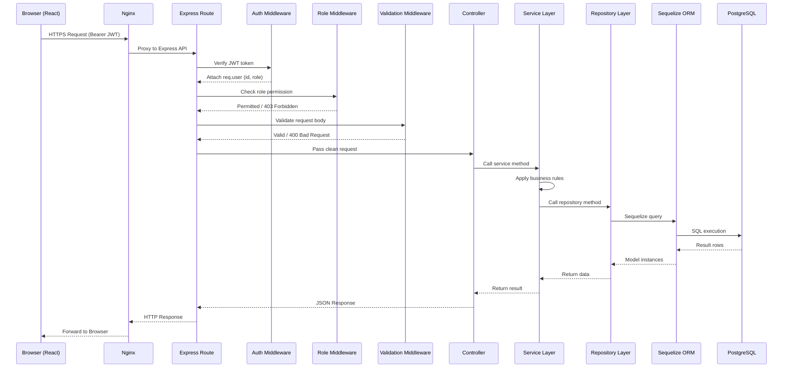
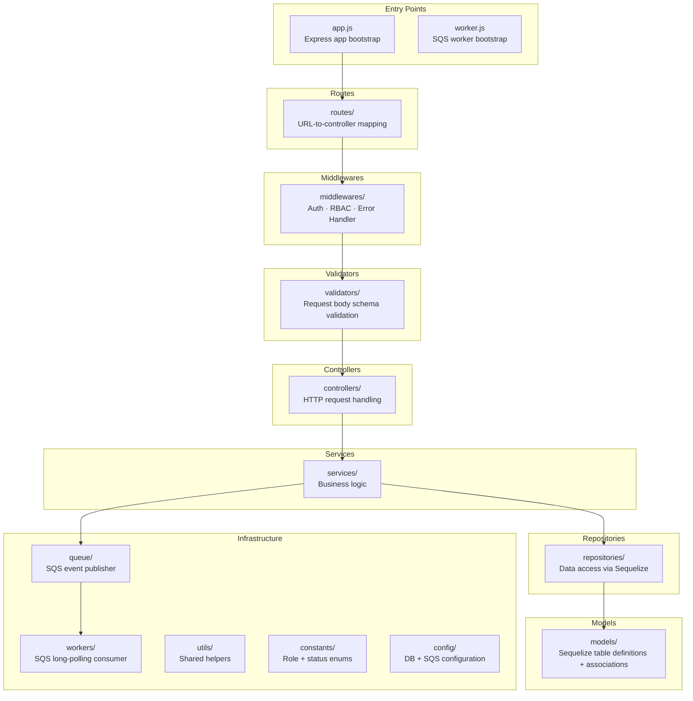
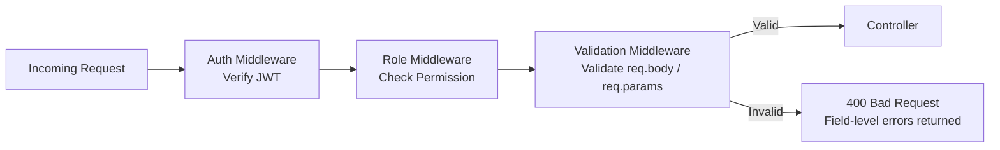

## Hospital Management System — API Design & Backend Structure
---

## 1. API Design Principles

Before listing individual APIs, the following principles govern the entire API design. These principles ensure the API is consistent, predictable, and easy to maintain.

| Principle | Description |
|---|---|
| **RESTful Design** | The API follows REST conventions. Resources are nouns (`/doctors`, `/patients`, `/appointments`). HTTP methods define the action performed on those resources. |
| **Resource-Based Endpoints** | Endpoints represent resources, not actions. `/appointments/:id/cancel` uses a sub-action on a resource rather than `/cancelAppointment`. |
| **Consistent Naming** | All endpoints use lowercase, hyphen-separated slugs where needed. All route parameters use `:id` consistently. |
| **Versioned API** | All routes are prefixed with `/api/v1`. If the API changes in a breaking way, a `/api/v2` prefix can be introduced without affecting existing clients. |
| **HTTP Status Codes** | Every response returns the appropriate HTTP status code. Status codes are not invented — they follow the standard HTTP specification. |
| **JWT Authentication** | Every protected endpoint requires a valid `Authorization: Bearer <token>` header. The token is verified by authentication middleware before the request reaches the controller. |
| **Role-Based Authorization** | After authentication, a role middleware checks whether the authenticated user's role is permitted to perform the requested action. Unauthorized requests receive a `403` response. |
| **Standard Response Structure** | Every API response — success or error — returns the same JSON envelope format. The frontend always knows what shape to expect. |
| **Input Validation** | All incoming request bodies are validated before reaching the controller. Invalid requests are rejected at the validation layer with clear field-level error messages. |
| **Error Handling** | All errors are caught by a global error handler middleware and returned as structured JSON. No raw error messages or stack traces are exposed to clients. |

**Base URL:** `/api/v1`
**Authentication Header:** `Authorization: Bearer <JWT_TOKEN>`

---

## 2. REST API Design

---

### 2.1 Authentication

---

#### POST `/api/v1/auth/login`

| Field | Detail |
|---|---|
| **Purpose** | Authenticates a user and returns a JWT token. Used by all three roles — Admin, Receptionist, Doctor. |
| **Method** | `POST` |
| **Endpoint** | `/api/v1/auth/login` |
| **Auth Required** | No |
| **Allowed Roles** | Public |

**Request Body:**

| Field | Type | Required | Description |
|---|---|---|---|
| `email` | String | Yes | Registered user email address |
| `password` | String | Yes | User's password |

**Success Response — `200 OK`:**

```
{
  "success": true,
  "message": "Login successful",
  "data": {
    "token": "<JWT>",
    "user": {
      "id": "<uuid>",
      "fullName": "Dr. Jane Smith",
      "email": "jane@hospital.com",
      "role": "doctor"
    }
  },
  "timestamp": "<ISO timestamp>"
}
```

**Validation Rules:**

| Field | Rule |
|---|---|
| `email` | Required. Must be a valid email format. |
| `password` | Required. Must not be empty. |

**Error Responses:**

| Status | Scenario |
|---|---|
| `400` | Missing or invalid email/password format |
| `401` | Credentials do not match any active user |
| `403` | User account is inactive (`is_active = false`) |

---

#### POST `/api/v1/auth/logout`

| Field | Detail |
|---|---|
| **Purpose** | Logs the user out. Since JWT is stateless, the client is instructed to discard the token. The server acknowledges the request. |
| **Method** | `POST` |
| **Endpoint** | `/api/v1/auth/logout` |
| **Auth Required** | Yes |
| **Allowed Roles** | Admin, Receptionist, Doctor |

**Request Body:** None

**Success Response — `200 OK`:**

```
{
  "success": true,
  "message": "Logged out successfully",
  "data": null,
  "timestamp": "<ISO timestamp>"
}
```

**Error Responses:**

| Status | Scenario |
|---|---|
| `401` | Token is missing or invalid |

---

#### POST `/api/v1/auth/forgot-password`


| Field | Detail |
|---|---|
| **Purpose** | Accepts a registered email address and triggers a password reset email to the user via the SQS notification pipeline. |
| **Method** | `POST` |
| **Endpoint** | `/api/v1/auth/forgot-password` |
| **Auth Required** | No |
| **Allowed Roles** | Public |

**Request Body:**

| Field | Type | Required | Description |
|---|---|---|---|
| `email` | String | Yes | The email address associated with the account |

**Success Response — `200 OK`:**

```
{
  "success": true,
  "message": "If this email is registered, a reset link has been sent.",
  "data": null,
  "timestamp": "<ISO timestamp>"
}
```

> **Note:** The response message is intentionally generic to prevent email enumeration attacks — the same message is returned whether or not the email exists.

**Validation Rules:**

| Field | Rule |
|---|---|
| `email` | Required. Must be a valid email format. |

**Error Responses:**

| Status | Scenario |
|---|---|
| `400` | Missing or invalid email format |

---

### 2.2 Doctor Management

---

#### POST `/api/v1/admin/doctor`

| Field | Detail |
|---|---|
| **Purpose** | Creates a new doctor record and the associated user login account. |
| **Method** | `POST` |
| **Endpoint** | `/api/v1/admin/doctor` |
| **Auth Required** | Yes |
| **Allowed Roles** | Admin |

**Request Body:**

| Field | Type | Required | Description |
|---|---|---|---|
| `fullName` | String | Yes | Doctor's full name |
| `email` | String | Yes | Doctor's email — used for login |
| `password` | String | Yes | Initial password for the doctor's account |
| `specialization` | String | Yes | Medical specialization (e.g., Cardiology) |
| `mobile` | String | Yes | Doctor's contact number |
| `consultationFee` | Number | Yes | Fee per consultation session |

**Success Response — `201 Created`:**

```
{
  "success": true,
  "message": "Doctor created successfully",
  "data": {
    "id": "<uuid>",
    "fullName": "Dr. Jane Smith",
    "email": "jane@hospital.com",
    "specialization": "Cardiology",
    "mobile": "9876543210",
    "consultationFee": 500.00
  },
  "timestamp": "<ISO timestamp>"
}
```

**Validation Rules:**

| Field | Rule |
|---|---|
| `fullName` | Required. String. Min 2 characters. |
| `email` | Required. Valid email. Must not already exist in the system. |
| `password` | Required. Minimum 8 characters. |
| `specialization` | Required. String. |
| `mobile` | Required. Valid numeric mobile number format. |
| `consultationFee` | Required. Positive number. |

**Error Responses:**

| Status | Scenario |
|---|---|
| `400` | Validation failure on any field |
| `401` | Request is unauthenticated |
| `403` | Authenticated user is not an Admin |
| `409` | Email already exists in the system |

---

#### GET `/api/v1/admin/doctor`

| Field | Detail |
|---|---|
| **Purpose** | Returns the list of all active (non-soft-deleted) doctors in the hospital. |
| **Method** | `GET` |
| **Endpoint** | `/api/v1/doctors` |
| **Auth Required** | Yes |
| **Allowed Roles** | Admin |

**Request Parameters:** None

**Success Response — `200 OK`:**

```
{
  "success": true,
  "message": "Doctors retrieved successfully",
  "data": [
    {
      "id": "<uuid>",
      "fullName": "Dr. Jane Smith",
      "specialization": "Cardiology",
      "mobile": "9876543210",
      "consultationFee": 500.00,
      "email": "jane@hospital.com"
    }
  ],
  "timestamp": "<ISO timestamp>"
}
```

**Error Responses:**

| Status | Scenario |
|---|---|
| `401` | Unauthenticated |
| `403` | Not an Admin |

---

#### GET `/api/v1/admin/doctor/:id`

| Field | Detail |
|---|---|
| **Purpose** | Returns the full profile of a specific doctor by ID. |
| **Method** | `GET` |
| **Endpoint** | `/api/v1/admin/doctor/:id` |
| **Auth Required** | Yes |
| **Allowed Roles** | Admin, Doctor (own profile only) |

**Request Parameters:**

| Parameter | Type | Description |
|---|---|---|
| `id` | UUID | The doctor's unique identifier |

**Success Response — `200 OK`:**

```
{
  "success": true,
  "message": "Doctor retrieved successfully",
  "data": {
    "id": "<uuid>",
    "fullName": "Dr. Jane Smith",
    "specialization": "Cardiology",
    "mobile": "9876543210",
    "consultationFee": 500.00,
    "email": "jane@hospital.com",
    "hospital": {
      "id": "<uuid>",
      "name": "City General Hospital"
    }
  },
  "timestamp": "<ISO timestamp>"
}
```

**Error Responses:**

| Status | Scenario |
|---|---|
| `401` | Unauthenticated |
| `403` | Role not permitted |
| `404` | Doctor not found or soft-deleted |

---

#### PUT `/api/v1/admin/doctor/:id`

| Field | Detail |
|---|---|
| **Purpose** | Updates an existing doctor's professional details. |
| **Method** | `PUT` |
| **Endpoint** | `/api/v1/admin/doctor/:id` |
| **Auth Required** | Yes |
| **Allowed Roles** | Admin |

**Request Parameters:**

| Parameter | Type | Description |
|---|---|---|
| `id` | UUID | The doctor's unique identifier |

**Request Body:**

| Field | Type | Required | Description |
|---|---|---|---|
| `fullName` | String | No | Updated full name |
| `specialization` | String | No | Updated specialization |
| `mobile` | String | No | Updated mobile number |
| `consultationFee` | Number | No | Updated consultation fee |

**Success Response — `200 OK`:**

```
{
  "success": true,
  "message": "Doctor updated successfully",
  "data": {
    "id": "<uuid>",
    "fullName": "Dr. Jane Smith",
    "specialization": "Neurology",
    "mobile": "9876543210",
    "consultationFee": 600.00
  },
  "timestamp": "<ISO timestamp>"
}
```

**Validation Rules:**

| Field | Rule |
|---|---|
| `specialization` | Optional. If provided, must be a non-empty string. |
| `mobile` | Optional. If provided, must be a valid mobile format. |
| `consultationFee` | Optional. If provided, must be a positive number. |

**Error Responses:**

| Status | Scenario |
|---|---|
| `400` | Invalid field value |
| `401` | Unauthenticated |
| `403` | Not an Admin |
| `404` | Doctor not found |

---

#### DELETE `/api/v1/admin/doctor/:id`

| Field | Detail |
|---|---|
| **Purpose** | Soft-deletes a doctor by setting `deleted_at`. The doctor's historical appointments and records are preserved. |
| **Method** | `DELETE` |
| **Endpoint** | `/api/v1/admin/doctor/:id` |
| **Auth Required** | Yes |
| **Allowed Roles** | Admin |

**Request Parameters:**

| Parameter | Type | Description |
|---|---|---|
| `id` | UUID | The doctor's unique identifier |

**Success Response — `200 OK`:**

```
{
  "success": true,
  "message": "Doctor deleted successfully",
  "data": null,
  "timestamp": "<ISO timestamp>"
}
```

**Error Responses:**

| Status | Scenario |
|---|---|
| `401` | Unauthenticated |
| `403` | Not an Admin |
| `404` | Doctor not found or already deleted |

---

### 2.3 Doctor Availability

This module allows an Admin to configure a doctor's weekly working schedule. Based on the configured working hours and slot duration, the system automatically generates appointment time slots. Receptionists can only book appointments using these generated slots.

---

#### POST `/api/v1/admin/doctors/:id/availability`

| Field             | Detail                                                                                                                                                                                                                  |
| ----------------- | ----------------------------------------------------------------------------------------------------------------------------------------------------------------------------------------------------------------------- |
| **Purpose**       | Creates a weekly availability schedule for a doctor. After the availability is successfully created, the system automatically generates appointment time slots based on the configured working hours and slot duration. |
| **Method**        | `POST`                                                                                                                                                                                                                  |
| **Endpoint**      | `/api/v1/admin/doctors/:id/availability`                                                                                                                                                                                      |
| **Auth Required** | Yes                                                                                                                                                                                                                     |
| **Allowed Roles** | Admin                                                                                                                                                                                                                   |

**Request Parameters:**

| Parameter | Type | Description                    |
| --------- | ---- | ------------------------------ |
| `id`      | UUID | The doctor's unique identifier |

**Request Body:**

| Field          | Type    | Required | Description                                  |
| -------------- | ------- | -------- | -------------------------------------------- |
| `dayOfWeek`    | String  | Yes      | Day of the week (`Monday` - `Sunday`)        |
| `startTime`    | Time    | Yes      | Doctor's working hour start time             |
| `endTime`      | Time    | Yes      | Doctor's working hour end time               |
| `slotDuration` | Integer | Yes      | Duration of each appointment slot in minutes |

**Success Response — `201 Created`:**

```json
{
  "success": true,
  "message": "Doctor availability created successfully",
  "data": {
    "id": "<uuid>",
    "doctorId": "<uuid>",
    "dayOfWeek": "Monday",
    "startTime": "09:00",
    "endTime": "13:00",
    "slotDuration": 30
  },
  "timestamp": "<ISO timestamp>"
}
```

**Validation Rules:**

| Field          | Rule                                                                                                                                             |
| -------------- | ------------------------------------------------------------------------------------------------------------------------------------------------ |
| `dayOfWeek`    | Required. Must be one of: Monday, Tuesday, Wednesday, Thursday, Friday, Saturday, Sunday. One availability record is allowed per doctor per day. |
| `startTime`    | Required. Must be earlier than `endTime`.                                                                                                        |
| `endTime`      | Required. Must be later than `startTime`.                                                                                                        |
| `slotDuration` | Required. Positive integer greater than zero.                                                                                                    |

**Error Responses:**

| Status | Scenario                                         |
| ------ | ------------------------------------------------ |
| `400`  | Validation failure                               |
| `401`  | Unauthenticated                                  |
| `403`  | Not an Admin                                     |
| `404`  | Doctor not found                                 |
| `409`  | Availability already exists for the selected day |

---

#### GET `/api/v1/admin/doctors/:id/availability`

| Field             | Detail                                                                         |
| ----------------- | ------------------------------------------------------------------------------ |
| **Purpose**       | Returns all configured weekly availability schedules for the specified doctor. |
| **Method**        | `GET`                                                                          |
| **Endpoint**      | `/api/v1/admin/:id/availability`                         |
| **Auth Required** | Yes                                                                            |
| **Allowed Roles** | Admin                                                                          |

**Request Parameters:**

| Parameter | Type | Description                    |
| --------- | ---- | ------------------------------ |
| `id`      | UUID | The doctor's unique identifier |

**Success Response — `200 OK`:**

```json
{
  "success": true,
  "message": "Doctor availability retrieved successfully",
  "data": [
    {
      "id": "<uuid>",
      "dayOfWeek": "Monday",
      "startTime": "09:00",
      "endTime": "13:00",
      "slotDuration": 30
    },
    {
      "id": "<uuid>",
      "dayOfWeek": "Tuesday",
      "startTime": "10:00",
      "endTime": "16:00",
      "slotDuration": 30
    }
  ],
  "timestamp": "<ISO timestamp>"
}
```

**Error Responses:**

| Status | Scenario         |
| ------ | ---------------- |
| `401`  | Unauthenticated  |
| `403`  | Not an Admin     |
| `404`  | Doctor not found |

---

#### PUT `/api/v1/admin/availability/:id`

| Field             | Detail                                                                                                                                                                                                                    |
| ----------------- | ------------------------------------------------------------------------------------------------------------------------------------------------------------------------------------------------------------------------- |
| **Purpose**       | Updates an existing doctor availability schedule. After a successful update, the system regenerates future appointment time slots. Availability cannot be updated if future appointments already exist for that schedule. |
| **Method**        | `PUT`                                                                                                                                                                                                                     |
| **Endpoint**      | `/api/v1/admin/availability/:id`                                                                                                                                                                                                |
| **Auth Required** | Yes                                                                                                                                                                                                                       |
| **Allowed Roles** | Admin                                                                                                                                                                                                                     |

**Request Parameters:**

| Parameter | Type | Description                        |
| --------- | ---- | ---------------------------------- |
| `id`      | UUID | The availability record identifier |

**Request Body:**

| Field          | Type    | Required | Description                      |
| -------------- | ------- | -------- | -------------------------------- |
| `startTime`    | Time    | No       | Updated working hour start time  |
| `endTime`      | Time    | No       | Updated working hour end time    |
| `slotDuration` | Integer | No       | Updated slot duration in minutes |

**Success Response — `200 OK`:**

```json
{
  "success": true,
  "message": "Doctor availability updated successfully",
  "data": {
    "id": "<uuid>",
    "dayOfWeek": "Monday",
    "startTime": "10:00",
    "endTime": "15:00",
    "slotDuration": 20
  },
  "timestamp": "<ISO timestamp>"
}
```

**Validation Rules:**

| Field          | Rule                                                   |
| -------------- | ------------------------------------------------------ |
| `startTime`    | Optional. If provided, must be earlier than `endTime`. |
| `endTime`      | Optional. If provided, must be later than `startTime`. |
| `slotDuration` | Optional. If provided, must be greater than zero.      |

**Error Responses:**

| Status | Scenario                                                |
| ------ | ------------------------------------------------------- |
| `400`  | Validation failure                                      |
| `401`  | Unauthenticated                                         |
| `403`  | Not an Admin                                            |
| `404`  | Availability not found                                  |
| `422`  | Future appointments already exist for this availability |

---

#### DELETE `/api/v1/admin/availability/:id`

| Field             | Detail                                                                                                                                                                |
| ----------------- | --------------------------------------------------------------------------------------------------------------------------------------------------------------------- |
| **Purpose**       | Deactivates a doctor's availability schedule. Historical appointment records remain unchanged and no new appointments can be booked against the deactivated schedule. |
| **Method**        | `DELETE`                                                                                                                                                              |
| **Endpoint**      | `/api/v1/admin/availability/:id`                                                                                                                                            |
| **Auth Required** | Yes                                                                                                                                                                   |
| **Allowed Roles** | Admin                                                                                                                                                                 |

**Request Parameters:**

| Parameter | Type | Description                        |
| --------- | ---- | ---------------------------------- |
| `id`      | UUID | The availability record identifier |

**Success Response — `200 OK`:**

```json
{
  "success": true,
  "message": "Doctor availability deactivated successfully",
  "data": null,
  "timestamp": "<ISO timestamp>"
}
```

**Error Responses:**

| Status | Scenario                                                |
| ------ | ------------------------------------------------------- |
| `401`  | Unauthenticated                                         |
| `403`  | Not an Admin                                            |
| `404`  | Availability not found                                  |
| `422`  | Future appointments already exist for this availability |

---

#### GET `/api/v1/admin/doctors/:id/available-slots`

| Field             | Detail                                                                                                                                      |
| ----------------- | ------------------------------------------------------------------------------------------------------------------------------------------- |
| **Purpose**       | Returns all available appointment time slots for a doctor on the specified date. Booked slots are automatically excluded from the response. |
| **Method**        | `GET`                                                                                                                                       |
| **Endpoint**      | `/api/v1/admin/doctors/:id/available-slots`                                                                                                       |
| **Auth Required** | Yes                                                                                                                                         |
| **Allowed Roles** | Admin, Receptionist                                                                                                                         |

**Request Parameters:**

| Parameter | Type | Description                    |
| --------- | ---- | ------------------------------ |
| `id`      | UUID | The doctor's unique identifier |

**Query Parameters:**

| Parameter | Type | Required | Description                     |
| --------- | ---- | -------- | ------------------------------- |
| `date`    | Date | Yes      | Appointment date (`YYYY-MM-DD`) |

**Success Response — `200 OK`:**

```json
{
  "success": true,
  "message": "Available slots retrieved successfully",
  "data": [
    {
      "id": "<uuid>",
      "startTime": "09:00",
      "endTime": "09:30"
    },
    {
      "id": "<uuid>",
      "startTime": "09:30",
      "endTime": "10:00"
    },
    {
      "id": "<uuid>",
      "startTime": "10:00",
      "endTime": "10:30"
    }
  ],
  "timestamp": "<ISO timestamp>"
}
```

**Error Responses:**

| Status | Scenario                |
| ------ | ----------------------- |
| `400`  | Missing or invalid date |
| `401`  | Unauthenticated         |
| `403`  | Role not permitted      |
| `404`  | Doctor not found        |


---

### 2.4 Patient Management

---

#### POST `/api/v1/patients`

| Field | Detail |
|---|---|
| **Purpose** | Registers a new patient. The `registered_by` field is automatically populated from the authenticated user's token. |
| **Method** | `POST` |
| **Endpoint** | `/api/v1/patients` |
| **Auth Required** | Yes |
| **Allowed Roles** | Admin, Receptionist |

**Request Body:**

| Field | Type | Required | Description |
|---|---|---|---|
| `fullName` | String | Yes | Patient's full name |
| `dateOfBirth` | Date | Yes | Patient's date of birth (YYYY-MM-DD) |
| `gender` | String | Yes | One of: `male`, `female`, `other` |
| `mobile` | String | Yes | Patient's contact number |
| `address` | String | No | Patient's residential address |

**Success Response — `201 Created`:**

```
{
  "success": true,
  "message": "Patient registered successfully",
  "data": {
    "id": "<uuid>",
    "fullName": "John Doe",
    "dateOfBirth": "1990-05-15",
    "gender": "male",
    "mobile": "9876543211",
    "address": "123 Main Street"
  },
  "timestamp": "<ISO timestamp>"
}
```

**Validation Rules:**

| Field | Rule |
|---|---|
| `fullName` | Required. Min 2 characters. |
| `dateOfBirth` | Required. Valid date. Must be in the past (cannot register an unborn patient). |
| `gender` | Required. Must be one of: `male`, `female`, `other`. |
| `mobile` | Required. Valid numeric mobile format. |
| `address` | Optional. String. |

**Error Responses:**

| Status | Scenario |
|---|---|
| `400` | Validation failure |
| `401` | Unauthenticated |
| `403` | Doctor attempting to register a patient |

---

#### GET `/api/v1/patients`

| Field | Detail |
|---|---|
| **Purpose** | Returns the list of all active (non-soft-deleted) patients in the hospital. |
| **Method** | `GET` |
| **Endpoint** | `/api/v1/patients` |
| **Auth Required** | Yes |
| **Allowed Roles** | Admin, Receptionist |

**Request Parameters:** None

**Success Response — `200 OK`:**

```
{
  "success": true,
  "message": "Patients retrieved successfully",
  "data": [
    {
      "id": "<uuid>",
      "fullName": "John Doe",
      "dateOfBirth": "1990-05-15",
      "gender": "male",
      "mobile": "9876543211"
    }
  ],
  "timestamp": "<ISO timestamp>"
}
```

**Error Responses:**

| Status | Scenario |
|---|---|
| `401` | Unauthenticated |
| `403` | Not permitted (Doctor role) |

---

#### GET `/api/v1/patients/:id`

| Field | Detail |
|---|---|
| **Purpose** | Returns full details of a specific patient. Doctors can view patient details when the patient has an appointment assigned to them. |
| **Method** | `GET` |
| **Endpoint** | `/api/v1/patients/:id` |
| **Auth Required** | Yes |
| **Allowed Roles** | Admin, Receptionist, Doctor |

**Request Parameters:**

| Parameter | Type | Description |
|---|---|---|
| `id` | UUID | The patient's unique identifier |

**Success Response — `200 OK`:**

```
{
  "success": true,
  "message": "Patient retrieved successfully",
  "data": {
    "id": "<uuid>",
    "fullName": "John Doe",
    "dateOfBirth": "1990-05-15",
    "gender": "male",
    "mobile": "9876543211",
    "address": "123 Main Street"
  },
  "timestamp": "<ISO timestamp>"
}
```

**Error Responses:**

| Status | Scenario |
|---|---|
| `401` | Unauthenticated |
| `404` | Patient not found or soft-deleted |

---

#### PUT `/api/v1/patients/:id`

| Field | Detail |
|---|---|
| **Purpose** | Updates an existing patient's registration details. |
| **Method** | `PUT` |
| **Endpoint** | `/api/v1/patients/:id` |
| **Auth Required** | Yes |
| **Allowed Roles** | Admin, Receptionist |

**Request Parameters:**

| Parameter | Type | Description |
|---|---|---|
| `id` | UUID | The patient's unique identifier |

**Request Body:**

| Field | Type | Required | Description |
|---|---|---|---|
| `fullName` | String | No | Updated name |
| `mobile` | String | No | Updated mobile |
| `address` | String | No | Updated address |

**Success Response — `200 OK`:**

```
{
  "success": true,
  "message": "Patient updated successfully",
  "data": {
    "id": "<uuid>",
    "fullName": "John Doe",
    "mobile": "9999999999",
    "address": "456 New Street"
  },
  "timestamp": "<ISO timestamp>"
}
```

**Error Responses:**

| Status | Scenario |
|---|---|
| `400` | Validation failure |
| `401` | Unauthenticated |
| `403` | Not permitted |
| `404` | Patient not found |

---

### 2.5 Appointment Management

---

#### POST `/api/v1/appointments`

| Field | Detail |
|---|---|
| **Purpose** | Books a new appointment. The service layer validates that the slot is available, the date is not in the past, and the doctor works on that day. A notification event is published to SQS on success. |
| **Method** | `POST` |
| **Endpoint** | `/api/v1/appointments` |
| **Auth Required** | Yes |
| **Allowed Roles** | Admin, Receptionist |

**Request Body:**

| Field | Type | Required | Description |
|---|---|---|---|
| `doctorId` | UUID | Yes | The doctor being booked |
| `patientId` | UUID | Yes | The patient attending the appointment |
| `appointmentDate` | Date | Yes | The date of the appointment (YYYY-MM-DD) |
| `timeSlotId` | UUID | Yes | The time slot being reserved |

**Success Response — `201 Created`:**

```
{
  "success": true,
  "message": "Appointment booked successfully",
  "data": {
    "id": "<uuid>",
    "doctor": { "id": "<uuid>", "fullName": "Dr. Jane Smith" },
    "patient": { "id": "<uuid>", "fullName": "John Doe" },
    "appointmentDate": "2025-07-15",
    "slotTime": "10:00",
    "status": "booked"
  },
  "timestamp": "<ISO timestamp>"
}
```

**Validation Rules:**

| Field | Rule |
|---|---|
| `doctorId` | Required. Must reference an existing, active doctor. |
| `patientId` | Required. Must reference an existing, active patient. |
| `appointmentDate` | Required. Must not be a past date. |
| `timeSlotId` | Required. Must belong to the selected doctor. Must be active. |

**Error Responses:**

| Status | Scenario |
|---|---|
| `400` | Validation failure or past date |
| `401` | Unauthenticated |
| `403` | Doctor attempting to book |
| `404` | Doctor, patient, or time slot not found |
| `409` | Time slot already booked for that doctor on that date |

---

#### PUT `/api/v1/appointments/:id/reschedule`

| Field | Detail |
|---|---|
| **Purpose** | Reschedules an existing appointment to a new date or time slot. Only appointments with status `booked` can be rescheduled. |
| **Method** | `PUT` |
| **Endpoint** | `/api/v1/appointments/:id/reschedule` |
| **Auth Required** | Yes |
| **Allowed Roles** | Admin, Receptionist |

**Request Parameters:**

| Parameter | Type | Description |
|---|---|---|
| `id` | UUID | The appointment's unique identifier |

**Request Body:**

| Field | Type | Required | Description |
|---|---|---|---|
| `appointmentDate` | Date | Yes | New appointment date |
| `timeSlotId` | UUID | Yes | New time slot |

**Success Response — `200 OK`:**

```
{
  "success": true,
  "message": "Appointment rescheduled successfully",
  "data": {
    "id": "<uuid>",
    "appointmentDate": "2025-07-20",
    "slotTime": "11:00",
    "status": "booked"
  },
  "timestamp": "<ISO timestamp>"
}
```

**Validation Rules:**

| Field | Rule |
|---|---|
| `appointmentDate` | Required. Must not be a past date. |
| `timeSlotId` | Required. Must be active and belong to the same doctor. |

**Error Responses:**

| Status | Scenario |
|---|---|
| `400` | Past date or validation failure |
| `401` | Unauthenticated |
| `403` | Not permitted |
| `404` | Appointment not found |
| `409` | New slot already taken |
| `422` | Appointment is cancelled or completed — cannot reschedule |

---

#### PUT `/api/v1/appointments/:id/cancel`

| Field | Detail |
|---|---|
| **Purpose** | Cancels an appointment. Sets status to `cancelled` and records `cancelled_at`. Cancelled appointments cannot be edited thereafter. |
| **Method** | `PUT` |
| **Endpoint** | `/api/v1/appointments/:id/cancel` |
| **Auth Required** | Yes |
| **Allowed Roles** | Admin, Receptionist |

**Request Parameters:**

| Parameter | Type | Description |
|---|---|---|
| `id` | UUID | The appointment's unique identifier |

**Request Body:** None

**Success Response — `200 OK`:**

```
{
  "success": true,
  "message": "Appointment cancelled successfully",
  "data": {
    "id": "<uuid>",
    "status": "cancelled",
    "cancelledAt": "<ISO timestamp>"
  },
  "timestamp": "<ISO timestamp>"
}
```

**Error Responses:**

| Status | Scenario |
|---|---|
| `401` | Unauthenticated |
| `403` | Not permitted |
| `404` | Appointment not found |
| `422` | Appointment is already cancelled or completed |

---

#### GET `/api/v1/appointments`

| Field | Detail |
|---|---|
| **Purpose** | Returns the appointment history for the hospital. Supports optional filtering by date, doctor, patient, or status via query parameters. |
| **Method** | `GET` |
| **Endpoint** | `/api/v1/appointments` |
| **Auth Required** | Yes |
| **Allowed Roles** | Admin, Receptionist |

**Query Parameters (Optional Filters):**

| Parameter | Type | Description |
|---|---|---|
| `doctorId` | UUID | Filter by doctor |
| `patientId` | UUID | Filter by patient |
| `status` | String | Filter by status: `booked`, `completed`, `cancelled` |
| `date` | Date | Filter by appointment date |

**Success Response — `200 OK`:**

```
{
  "success": true,
  "message": "Appointments retrieved successfully",
  "data": [
    {
      "id": "<uuid>",
      "doctor": { "id": "<uuid>", "fullName": "Dr. Jane Smith" },
      "patient": { "id": "<uuid>", "fullName": "John Doe" },
      "appointmentDate": "2025-07-15",
      "slotTime": "10:00",
      "status": "booked"
    }
  ],
  "timestamp": "<ISO timestamp>"
}
```

**Error Responses:**

| Status | Scenario |
|---|---|
| `401` | Unauthenticated |
| `403` | Not permitted |

---

#### GET `/api/v1/appointments/today`

| Field | Detail |
|---|---|
| **Purpose** | Returns all appointments scheduled for today. Used by the Admin dashboard and Receptionist dashboard. |
| **Method** | `GET` |
| **Endpoint** | `/api/v1/appointments/today` |
| **Auth Required** | Yes |
| **Allowed Roles** | Admin, Receptionist |

**Request Parameters:** None

**Success Response — `200 OK`:**

```
{
  "success": true,
  "message": "Today's appointments retrieved successfully",
  "data": [
    {
      "id": "<uuid>",
      "doctor": { "fullName": "Dr. Jane Smith", "specialization": "Cardiology" },
      "patient": { "fullName": "John Doe" },
      "slotTime": "10:00",
      "status": "booked"
    }
  ],
  "timestamp": "<ISO timestamp>"
}
```

**Error Responses:**

| Status | Scenario |
|---|---|
| `401` | Unauthenticated |
| `403` | Not permitted |

---

#### GET `/api/v1/appointments/schedule`

| Field | Detail |
|---|---|
| **Purpose** | Returns the authenticated doctor's appointment schedule. When called by a Doctor, the schedule is scoped to their own appointments. When called by an Admin, a `doctorId` query parameter is required. |
| **Method** | `GET` |
| **Endpoint** | `/api/v1/appointments/schedule` |
| **Auth Required** | Yes |
| **Allowed Roles** | Admin, Doctor |

**Query Parameters:**

| Parameter | Type | Required | Description |
|---|---|---|---|
| `doctorId` | UUID | Required for Admin | The doctor whose schedule is being viewed |
| `date` | Date | No | Filter by specific date. Defaults to today if not provided. |

**Success Response — `200 OK`:**

```
{
  "success": true,
  "message": "Schedule retrieved successfully",
  "data": [
    {
      "id": "<uuid>",
      "patient": { "fullName": "John Doe" },
      "appointmentDate": "2025-07-15",
      "slotTime": "10:00",
      "status": "booked",
      "consultationNotes": null
    }
  ],
  "timestamp": "<ISO timestamp>"
}
```

**Error Responses:**

| Status | Scenario |
|---|---|
| `401` | Unauthenticated |
| `403` | Not permitted |
| `404` | Doctor not found (Admin passing invalid doctorId) |

---

### 2.6 Consultation

---

#### PUT `/api/v1/appointments/:id/notes`

| Field | Detail |
|---|---|
| **Purpose** | Allows a Doctor to add or update consultation notes for an appointment assigned to them. |
| **Method** | `PUT` |
| **Endpoint** | `/api/v1/appointments/:id/notes` |
| **Auth Required** | Yes |
| **Allowed Roles** | Doctor |

**Request Parameters:**

| Parameter | Type | Description |
|---|---|---|
| `id` | UUID | The appointment's unique identifier |

**Request Body:**

| Field | Type | Required | Description |
|---|---|---|---|
| `consultationNotes` | String | Yes | Notes written by the doctor after consultation |

**Success Response — `200 OK`:**

```
{
  "success": true,
  "message": "Consultation notes saved successfully",
  "data": {
    "id": "<uuid>",
    "consultationNotes": "Patient has mild hypertension. Prescribed rest."
  },
  "timestamp": "<ISO timestamp>"
}
```

**Validation Rules:**

| Field | Rule |
|---|---|
| `consultationNotes` | Required. Non-empty string. |

**Error Responses:**

| Status | Scenario |
|---|---|
| `400` | Validation failure |
| `401` | Unauthenticated |
| `403` | Not a Doctor, or appointment does not belong to this doctor |
| `404` | Appointment not found |
| `422` | Appointment is cancelled — notes cannot be added |

---

#### PUT `/api/v1/appointments/:id/complete`

| Field | Detail |
|---|---|
| **Purpose** | Marks an appointment as completed. Sets `status = 'completed'` and records `completed_at`. Once completed, the appointment cannot be modified. |
| **Method** | `PUT` |
| **Endpoint** | `/api/v1/appointments/:id/complete` |
| **Auth Required** | Yes |
| **Allowed Roles** | Doctor |

**Request Parameters:**

| Parameter | Type | Description |
|---|---|---|
| `id` | UUID | The appointment's unique identifier |

**Request Body:** None

**Success Response — `200 OK`:**

```
{
  "success": true,
  "message": "Appointment marked as completed",
  "data": {
    "id": "<uuid>",
    "status": "completed",
    "completedAt": "<ISO timestamp>"
  },
  "timestamp": "<ISO timestamp>"
}
```

**Error Responses:**

| Status | Scenario |
|---|---|
| `401` | Unauthenticated |
| `403` | Not a Doctor, or appointment does not belong to this doctor |
| `404` | Appointment not found |
| `422` | Appointment is already completed or cancelled |

---

### 2.7 Dashboard

---

#### GET `/api/v1/dashboard/admin`

| Field | Detail |
|---|---|
| **Purpose** | Returns aggregated metrics for the Admin dashboard as defined in the BRD. |
| **Method** | `GET` |
| **Endpoint** | `/api/v1/dashboard/admin` |
| **Auth Required** | Yes |
| **Allowed Roles** | Admin |

**Success Response — `200 OK`:**

```
{
  "success": true,
  "message": "Admin dashboard data retrieved",
  "data": {
    "totalDoctors": 12,
    "totalPatients": 340,
    "totalAppointments": 1250,
    "todaysAppointments": 28
  },
  "timestamp": "<ISO timestamp>"
}
```

**Error Responses:**

| Status | Scenario |
|---|---|
| `401` | Unauthenticated |
| `403` | Not an Admin |

---

#### GET `/api/v1/dashboard/receptionist`

| Field | Detail |
|---|---|
| **Purpose** | Returns the metrics relevant to the Receptionist dashboard as defined in the BRD. |
| **Method** | `GET` |
| **Endpoint** | `/api/v1/dashboard/receptionist` |
| **Auth Required** | Yes |
| **Allowed Roles** | Receptionist |

**Success Response — `200 OK`:**

```
{
  "success": true,
  "message": "Receptionist dashboard data retrieved",
  "data": {
    "todaysAppointments": 28,
    "upcomingAppointments": 74
  },
  "timestamp": "<ISO timestamp>"
}
```

**Error Responses:**

| Status | Scenario |
|---|---|
| `401` | Unauthenticated |
| `403` | Not a Receptionist |

---

#### GET `/api/v1/dashboard/doctor`

| Field | Detail |
|---|---|
| **Purpose** | Returns the metrics relevant to the Doctor's own dashboard as defined in the BRD. Scoped to the authenticated doctor's appointments only. |
| **Method** | `GET` |
| **Endpoint** | `/api/v1/dashboard/doctor` |
| **Auth Required** | Yes |
| **Allowed Roles** | Doctor |

**Success Response — `200 OK`:**

```
{
  "success": true,
  "message": "Doctor dashboard data retrieved",
  "data": {
    "todaysSchedule": 8,
    "completedConsultations": 142
  },
  "timestamp": "<ISO timestamp>"
}
```

**Error Responses:**

| Status | Scenario |
|---|---|
| `401` | Unauthenticated |
| `403` | Not a Doctor |

---

## 3. Standard API Response Format

Every API response — whether a success or an error — follows the same JSON envelope structure. This is a non-negotiable design decision.

### Success Response

```
{
  "success": true,
  "message": "Human-readable success message",
  "data": { ... },
  "timestamp": "2025-07-10T09:00:00.000Z"
}
```

### Error Response

```
{
  "success": false,
  "message": "Human-readable error message",
  "errors": [
    {
      "field": "email",
      "message": "Email is required"
    }
  ],
  "timestamp": "2025-07-10T09:00:00.000Z"
}
```

### Field Definitions

| Field | Type | Present In | Description |
|---|---|---|---|
| `success` | Boolean | Always | `true` for success, `false` for any error |
| `message` | String | Always | A human-readable description of the result |
| `data` | Object / Array / null | Success responses | The response payload. `null` for operations with no return data (e.g., logout, delete). |
| `errors` | Array / null | Error responses | Field-level validation errors. Each entry contains `field` and `message`. |
| `timestamp` | ISO String | Always | The UTC time at which the response was generated |

### Why a Standard Response Structure?

| Benefit | Explanation |
|---|---|
| **Predictable frontend handling** | The React frontend can write one Axios interceptor to handle all responses uniformly without custom logic per endpoint. |
| **Consistent error display** | Validation errors always arrive in the same `errors` array format, so the frontend UI can render field-level messages generically. |
| **Easier debugging** | The `timestamp` field helps correlate client-side errors with server-side logs during debugging. |
| **Cleaner API contracts** | New developers reading the API documentation immediately understand what every endpoint returns without reading individual implementations. |

---

## 4. HTTP Status Codes

| Code | Name | When It Is Used |
|---|---|---|
| `200` | OK | Any successful read or update operation (GET, PUT, DELETE). The request was processed and data is returned. |
| `201` | Created | A new resource was successfully created (POST for doctors, patients, appointments). |
| `400` | Bad Request | The request body failed validation — missing required fields, wrong data types, or invalid values. |
| `401` | Unauthorized | No token was provided, or the token is invalid or expired. The client must log in again. |
| `403` | Forbidden | The user is authenticated but their role does not have permission to perform this action. |
| `404` | Not Found | The requested resource does not exist in the database, or has been soft-deleted. |
| `409` | Conflict | A unique constraint was violated — for example, booking a time slot that is already taken, or creating a doctor with an email that already exists. |
| `422` | Unprocessable Entity | The request is syntactically valid but violates a business rule — for example, attempting to reschedule a cancelled appointment. |
| `500` | Internal Server Error | An unexpected error occurred on the server. The global error handler captures this and returns a safe, generic message to the client. |

---

## 5. Request Flow

This diagram shows the complete lifecycle of an authenticated API request from the browser to the database and back.



### Step-by-Step Explanation

| Step | Component | Responsibility |
|---|---|---|
| **1** | **Browser** | The React application sends an HTTPS request with the JWT in the `Authorization` header. |
| **2** | **Nginx** | Receives the request on port 443. Terminates SSL and proxies the request to the Node.js API server running internally. |
| **3** | **Express Route** | Matches the URL and HTTP method to the correct route definition. Initiates the middleware chain. |
| **4** | **Auth Middleware** | Extracts the JWT from the header, verifies its signature and expiry, and attaches the decoded user object (`id`, `role`) to the request. Returns `401` if the token is missing or invalid. |
| **5** | **Role Middleware** | Compares `req.user.role` against the list of roles permitted for this route. Returns `403` if the role is not authorized. |
| **6** | **Validation Middleware** | Validates `req.body` and `req.params` against the defined schema for this endpoint. Returns `400` with field-level errors if validation fails. |
| **7** | **Controller** | Receives the clean, validated request. Extracts the relevant data and calls exactly one service method. Sends the HTTP response with the result. |
| **8** | **Service Layer** | Contains all business logic. Applies rules (slot conflict check, date validation, status checks). Calls one or more repository methods. Publishes notification events to SQS when required. |
| **9** | **Repository Layer** | Executes the required database operations via Sequelize model methods. Returns plain model instances to the service. Contains no business logic. |
| **10** | **Sequelize ORM** | Translates repository method calls into parameterized SQL queries. Manages the connection pool to PostgreSQL. |
| **11** | **PostgreSQL** | Executes the SQL. Enforces constraints (UNIQUE, FOREIGN KEY, NOT NULL). Returns result rows. |
| **12** | **Response** | The result travels back up through each layer. The controller wraps it in the standard response envelope and sends it to Nginx, which forwards it to the browser. |

---

## 6. Backend Folder Structure

```
hospital-management-system/
│
├── src/
│   │
│   ├── config/
│   │   ├── database.js          # Sequelize connection configuration
│   │   └── sqs.js               # AWS SQS client configuration
│   │
│   ├── constants/
│   │   ├── roles.js             # Role name constants (ADMIN, RECEPTIONIST, DOCTOR)
│   │   └── appointmentStatus.js # Status constants (BOOKED, COMPLETED, CANCELLED)
│   │
│   ├── controllers/
│   │   ├── auth.controller.js
│   │   ├── doctor.controller.js
│   │   ├── patient.controller.js
│   │   ├── appointment.controller.js
│   │   ├── dashboard.controller.js
|   |   └── availability.controller.js
|   | 
│   │
│   ├── middlewares/
│   │   ├── authenticate.js      # JWT verification middleware
│   │   ├── authorize.js         # Role-based access control middleware
│   │   └── errorHandler.js      # Global error handler middleware
│   │
│   ├── migrations/
│   │   └── (Sequelize migration files — one per schema change)
│   │
│   ├── models/
│   │   ├── index.js             # Sequelize instance + association definitions
│   │   ├── hospital.model.js
│   │   ├── user.model.js
│   │   ├── doctor.model.js
│   │   ├── patient.model.js
│   │   ├── doctorAvailability.model.js
│   │   ├── timeSlot.model.js
│   │   └── appointment.model.js
│   │
│   ├── queue/
│   │   └── sqs.publisher.js     # Publishes notification events to Amazon SQS
│   │
│   ├── repositories/
│   │   ├── user.repository.js
│   │   ├── doctor.repository.js
|   |   ├── availability.repository.js
│   │   ├── patient.repository.js
│   │   └── appointment.repository.js
│   │
│   ├── routes/
│   │   ├── index.js             # Mounts all routers under /api/v1
│   │   ├── auth.routes.js
|   |   ├── availability.routes.js
│   │   ├── doctor.routes.js
│   │   ├── patient.routes.js
│   │   ├── appointment.routes.js
│   │   └── dashboard.routes.js
│   │
│   ├── seeders/
│   │   └── (Sequelize seeder files — initial data, e.g., hospital and admin user)
│   │
│   ├── services/
│   │   ├── auth.service.js
│   │   ├── doctor.service.js
│   │   ├── patient.service.js
│   │   ├── appointment.service.js
|   |   ├── availability.service.js
│   │   ├── dashboard.service.js
│   │   └── notification.service.js  # Builds and publishes SQS events
│   │
│   ├── utils/
│   │   └── responseHelper.js    # Builds standard success/error response objects
│   │
│   └── validators/
│       ├── auth.validator.js
│       ├── doctor.validator.js
|       ├── availability.validator.js   
│       ├── patient.validator.js
│       └── appointment.validator.js
│
├── workers/
│   └── notification.worker.js   # SQS long-polling consumer + SMTP mailer
│
├── app.js                       # Express app setup — registers routes and middleware
└── worker.js                    # Entry point for the PM2 notification worker process
```

---

## 7. Responsibility of Each Layer



| Layer | File Location | Responsibility |
|---|---|---|
| **Routes** | `src/routes/` | Maps URL paths and HTTP methods to controller functions. Attaches the middleware chain (auth → role → validation) to each route. Zero logic. |
| **Controllers** | `src/controllers/` | Handles the HTTP layer. Reads `req.body`, `req.params`, `req.user`. Calls one service method. Sends the response using `responseHelper`. No business logic. |
| **Services** | `src/services/` | The application's brain. All business rules live here: slot conflict checks, status transition validation, date validation, role-specific guards. Calls repositories. Calls `NotificationService` after successful operations. |
| **Repositories** | `src/repositories/` | The only layer that interacts with Sequelize models directly. Exposes named, descriptive methods (`findConflict`, `findByDoctor`, `createAppointment`). No business logic. |
| **Models** | `src/models/` | Sequelize model definitions — column types, constraints, default values, `paranoid` (soft delete). `index.js` defines all associations between models. |
| **Validators** | `src/validators/` | Defines the validation schema for each request body. Run as middleware before the controller is called. Reject invalid requests immediately with field-level errors. |
| **Middlewares** | `src/middlewares/` | **`authenticate.js`** — verifies the JWT and sets `req.user`. **`authorize.js`** — checks the user's role against the permitted roles for the route. **`errorHandler.js`** — catches all unhandled errors and returns a consistent JSON error response. |
| **Workers** | `workers/` | A separate Node.js process managed by PM2. Runs the SQS long-polling loop, reads notification messages from the queue, and sends emails via SMTP using Nodemailer. |
| **Queue** | `src/queue/` | The SQS publisher. Called by `NotificationService` to push a notification event message to the SQS queue. Decouples email sending from the main API request. |
| **Utils** | `src/utils/` | Shared utility functions. `responseHelper.js` provides `sendSuccess` and `sendError` helpers to ensure consistent response formatting from every controller. |
| **Constants** | `src/constants/` | Named constants for roles (`ADMIN`, `RECEPTIONIST`, `DOCTOR`) and appointment statuses (`BOOKED`, `COMPLETED`, `CANCELLED`). Prevents raw string comparisons scattered across the codebase. |
| **Config** | `src/config/` | Environment-specific configuration. `database.js` holds the Sequelize connection setup. `sqs.js` initialises the AWS SQS client. Values are read from environment variables — never hardcoded. |
| **Migrations** | `src/migrations/` | Sequelize migration files — one file per schema change. Versioned and committed to Git. Run on deployment to bring the database schema up to date. |
| **Seeders** | `src/seeders/` | Sequelize seeder files for initial data. At minimum: one hospital record and one Admin user account, required to bootstrap the system. |

---

## 8. Request Validation Strategy

### Where Validation Happens

All request validation occurs in the **Validator Middleware layer** — after the auth and role middlewares and **before** the request reaches the controller.



### Why Validation Belongs Before the Controller

| Reason | Explanation |
|---|---|
| **Single responsibility** | The controller should only handle HTTP mechanics — reading the request and sending a response. It should not contain field presence checks. |
| **Fail fast** | Invalid requests are rejected as early as possible, before any database calls or business logic runs. This saves resources. |
| **Consistent errors** | All validation errors are returned in the same format because they all pass through the same validation middleware. |
| **Reusability** | A validator schema can be attached to multiple routes. For example, a shared UUID format validator can be reused across all endpoints that accept an `:id` parameter. |

### Validation Examples by Module

#### Login Validation
| Field | Rule |
|---|---|
| `email` | Required. Must be a valid email format. |
| `password` | Required. Must not be empty. |

#### Doctor Creation Validation
| Field | Rule |
|---|---|
| `fullName` | Required. String. Minimum 2 characters. |
| `email` | Required. Valid email. Must not already exist. |
| `password` | Required. Minimum 8 characters. |
| `specialization` | Required. Non-empty string. |
| `mobile` | Required. Valid numeric format. |
| `consultationFee` | Required. Positive number. |

#### Patient Registration Validation
| Field | Rule |
|---|---|
| `fullName` | Required. String. Minimum 2 characters. |
| `dateOfBirth` | Required. Valid date format. Must be in the past. |
| `gender` | Required. Must be one of: `male`, `female`, `other`. |
| `mobile` | Required. Valid numeric mobile format. |
| `address` | Optional. String. |

#### Appointment Booking Validation
| Field | Rule |
|---|---|
| `doctorId` | Required. Valid UUID format. |
| `patientId` | Required. Valid UUID format. |
| `appointmentDate` | Required. Valid date format. |
| `timeSlotId` | Required. Valid UUID format. |

> **Note on date validation:** The `appointmentDate` format is validated by the Validator Middleware. The business rule — "must not be in the past" — is validated by the **Service Layer**, because it compares against the current runtime date, not a static schema rule.

---

## 9. Role-Based Access Control Matrix

This matrix defines exactly which actions each role can perform, derived directly from the BRD.

| Feature | Admin | Receptionist | Doctor |
|---|:---:|:---:|:---:|
| **Authentication** | | | |
| Login | ✅ | ✅ | ✅ |
| Logout | ✅ | ✅ | ✅ |
| Forgot Password | ✅ | ✅ | ✅ |
| **Doctor Management** | | | |
| Create Doctor | ✅ | ❌ | ❌ |
| Update Doctor | ✅ | ❌ | ❌ |
| Delete Doctor (Soft) | ✅ | ❌ | ❌ |
| View Doctor List | ✅ | ❌ | ❌ |
| View Doctor Details | ✅ | ❌ | ✅ (own) |
| **Doctor Availability**	| | | |		
|Create Availability	| ✅ |	❌ |	❌ |
|View Availability	| ✅ |	❌ |	❌ | 
|Update Availability	| ✅ |	❌ |	❌ |
|Deactivate Availability	| ✅ |	❌ |	❌ |
| **Patient Management** | | | |
| Register Patient | ✅ | ✅ | ❌ |
| Update Patient | ✅ | ✅ | ❌ |
| View Patient List | ✅ | ✅ | ❌ |
| View Patient Details | ✅ | ✅ | ✅ |
| **Appointment Management** | | | |
| Book Appointment | ✅ | ✅ | ❌ |
| Reschedule Appointment | ✅ | ✅ | ❌ |
| Cancel Appointment | ✅ | ✅ | ❌ |
| View Appointment History | ✅ | ✅ | ❌ |
| View Today's Appointments | ✅ | ✅ | ❌ |
| View Doctor Schedule | ✅ | ❌ | ✅ (own) |
| **Consultation** | | | |
| Add Consultation Notes | ❌ | ❌ | ✅ |
| Mark Appointment Completed | ❌ | ❌ | ✅ |
| **Dashboard** | | | |
| Admin Dashboard | ✅ | ❌ | ❌ |
| Receptionist Dashboard | ❌ | ✅ | ❌ |
| Doctor Dashboard | ❌ | ❌ | ✅ |

> **Legend:** ✅ Permitted &nbsp;&nbsp; ❌ Not Permitted &nbsp;&nbsp; ✅ (own) Permitted for own records only

---

## 10. API Module Summary

| Module | APIs | Endpoints | Purpose |
|---|:---:|---|---|
| **Authentication** | 3 | `POST /auth/login` · `POST /auth/logout` · `POST /auth/forgot-password`* | User login, logout, and optional password reset |
| **Doctors** | 5 | `POST /doctors` · `GET /doctors` · `GET /doctors/:id` · `PUT /doctors/:id` · `DELETE /doctors/:id` | Full doctor lifecycle management for the Admin |
| **Doctor Availability** |   5  | `POST /doctors/:id/availability` · `GET /doctors/:id/availability` · `PUT /availability/:id` · `DELETE /availability/:id` · `GET /doctors/:id/available-slots` | Configure weekly doctor schedules and retrieve available appointment slots, done by admin |
| **Patients** | 4 | `POST /patients` · `GET /patients` · `GET /patients/:id` · `PUT /patients/:id` | Patient registration and profile management, done my receptionist |
| **Appointments** | 6 | `POST /appointments` · `PUT /:id/reschedule` · `PUT /:id/cancel` · `GET /appointments` · `GET /appointments/today` · `GET /appointments/schedule` | Complete appointment booking lifecycle managed by receptionist |
| **Consultation** | 2 | `PUT /appointments/:id/notes` · `PUT /appointments/:id/complete` | Doctor-side consultation workflow |
| **Dashboard** | 3 | `GET /dashboard/admin` · `GET /dashboard/receptionist` · `GET /dashboard/doctor` | Role-specific metric summaries, for admin |

| **Total** | **28** | | |


---


