# Hospital Management System
## Flow Design Document

**Architecture:** Layered Monolith
**Stack:** Node.js · Express.js · PostgreSQL · Sequelize ORM · JWT · Amazon SQS
**Deployment:** AWS EC2 · PM2 · Nginx

---

## 1. Business Flow Diagrams

### 1.1 Patient Registration & Appointment Booking

This flow describes how a Receptionist registers a new patient and books an appointment. The system checks whether the patient already exists before creating a new record. Once a slot is confirmed, the appointment is stored and a notification is dispatched asynchronously.

### 1.1 Patient Registration & Appointment Booking

This flow describes how a Receptionist registers a new patient and books an appointment. The system checks whether the patient already exists before creating a new record. Once a slot is confirmed, the appointment is stored and a notification is dispatched asynchronously.

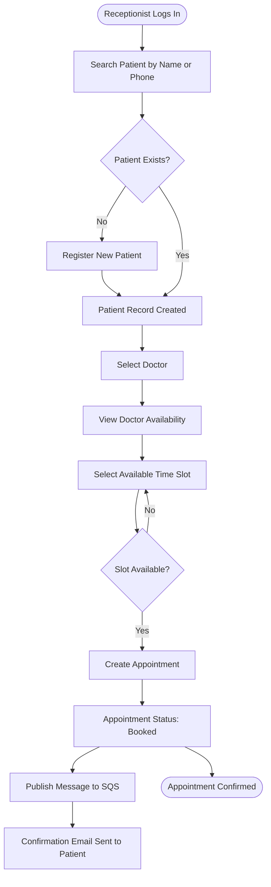

---

### 1.2 Doctor Consultation Flow

This flow describes how a Doctor views their assigned appointments, reviews patient details, records consultation notes, and marks the appointment as completed.

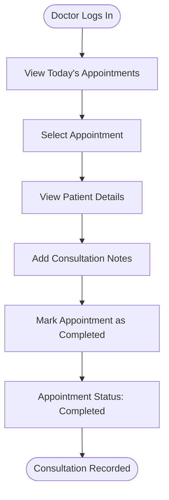

---

### 1.3 Appointment Cancellation Flow

This flow describes how a Receptionist cancels an existing appointment. The system enforces the business rule that only booked appointments can be cancelled. Cancelled and completed appointments cannot be modified.

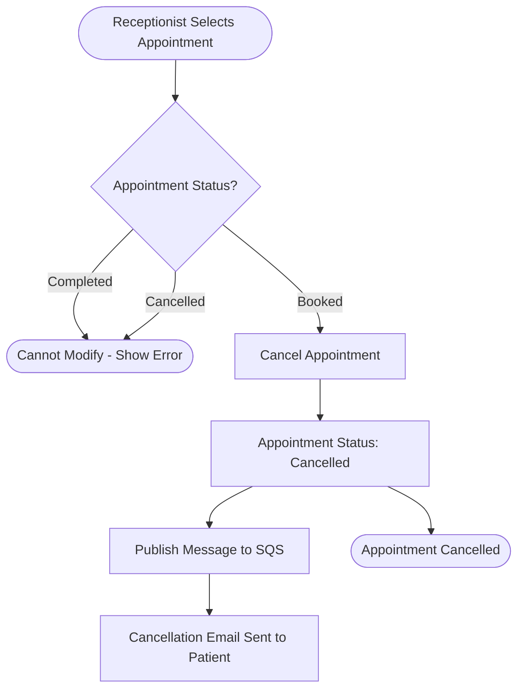

---

## 2. Sequence Diagrams

### 2.1 Authentication Sequence

This diagram shows the end-to-end flow of a user login request. The system validates credentials against the database, generates a JWT on success, and returns it to the client. The token is used for all subsequent authenticated requests.

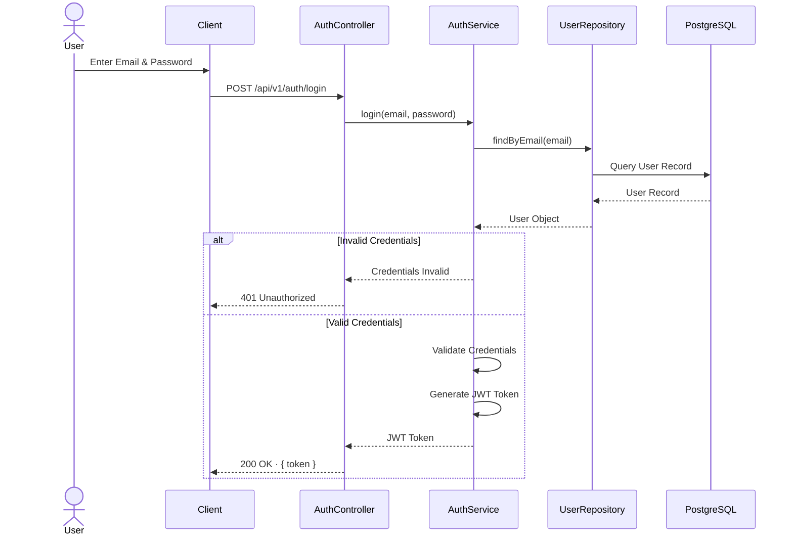

---

### 2.2 Appointment Booking Sequence

This diagram shows how a Receptionist books an appointment. The service layer checks for slot conflicts before persisting the appointment. On success, a message is published to SQS and the API response is returned immediately without waiting for the notification to be delivered.

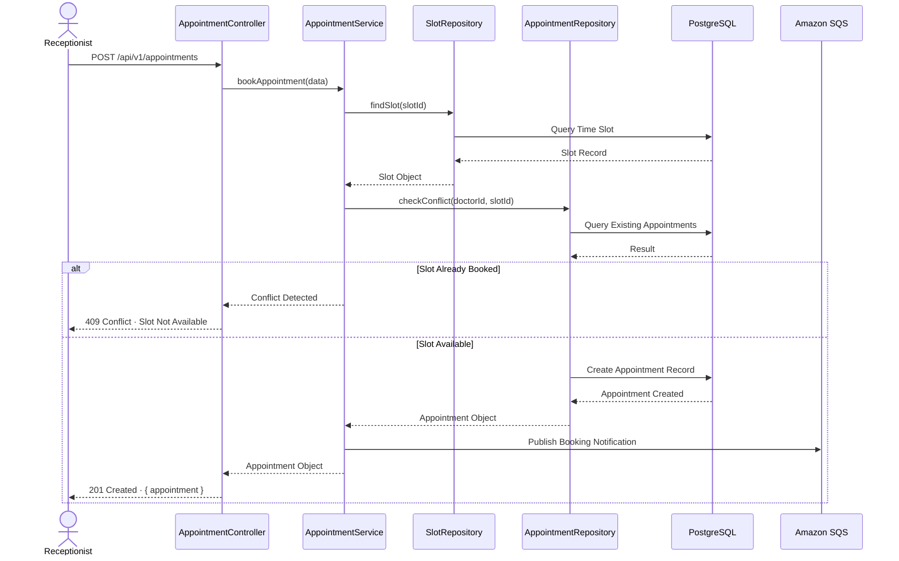

---

### 2.3 Doctor Views Appointments Sequence

This diagram shows how a Doctor retrieves their assigned appointments. The authentication middleware validates the JWT and attaches the user identity to the request before it reaches the controller.

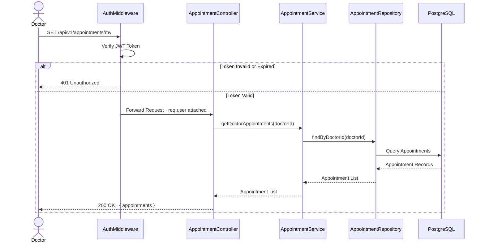

---

## 3. Request Lifecycle

Every API request passes through a consistent set of layers before reaching business logic. This ensures that authentication, authorization, and validation concerns are handled uniformly across all routes.

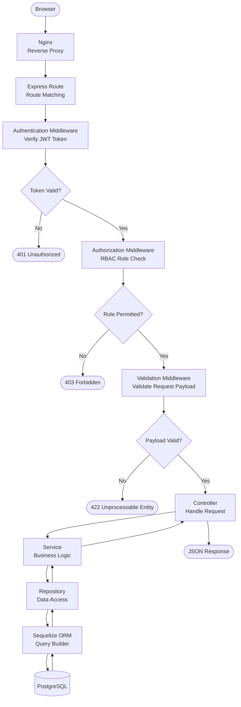

### Layer Responsibilities

| Layer | Responsibility |
|---|---|
| **Nginx** | Accepts incoming HTTP requests and forwards them to the Node.js application. Acts as a reverse proxy. |
| **Express Route** | Matches the incoming URL and HTTP method to the correct controller handler. |
| **Authentication Middleware** | Verifies the JWT token on every protected route. Attaches the decoded user identity to the request. |
| **Authorization Middleware** | Checks whether the authenticated user's role is permitted to access the requested route. |
| **Validation Middleware** | Validates the structure and content of the request body before it reaches business logic. |
| **Controller** | Receives the validated request, delegates to the service layer, and returns the formatted response. |
| **Service** | Contains all business logic. Enforces business rules such as slot conflict checks and status transitions. |
| **Repository** | Abstracts all database interactions. The service layer never queries the database directly. |
| **Sequelize ORM** | Translates repository calls into database queries. Handles soft delete filtering automatically. |
| **PostgreSQL** | Stores and retrieves all persistent data. |

---

## 4. AWS Component Flow

The system is deployed on a single AWS EC2 instance. Nginx acts as the entry point, PM2 manages the Node.js process, and Amazon SQS decouples notification delivery from the API response.

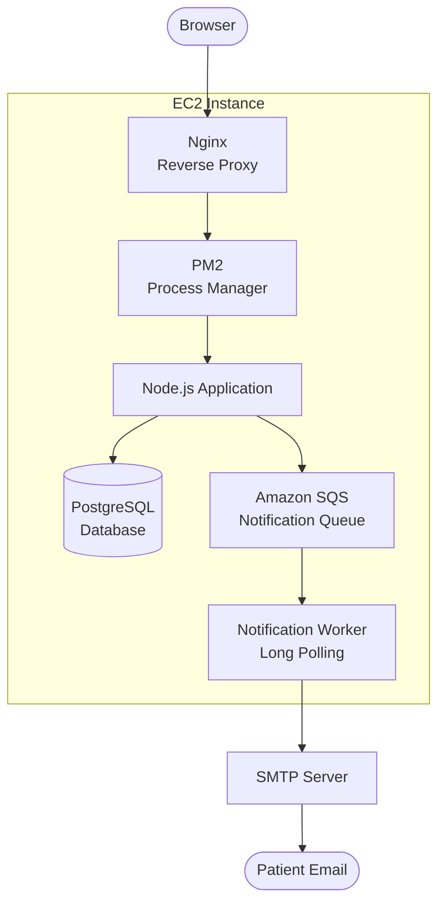

### Component Communication

| Component | Role | Why It Exists |
|---|---|---|
| **Nginx** | Receives all incoming HTTP requests and forwards them to the Node.js application. | Provides a stable entry point and isolates the application from direct internet exposure. |
| **PM2** | Manages the Node.js process. Restarts the application automatically if it crashes. | Ensures the application remains running without manual intervention. |
| **Node.js Application** | Handles all API requests, applies business logic, and interacts with the database. | The core of the system. All modules are served from this single process. |
| **PostgreSQL** | Stores all persistent data including users, doctors, patients, appointments, and time slots. | Runs on the same EC2 instance to keep the architecture simple for the current scope. |
| **Amazon SQS** | Receives notification messages published by the application after appointment events. | Decouples notification delivery from the API response. The application does not wait for the email to be sent before returning a response. |
| **Notification Worker** | A background process that polls SQS for messages and triggers email delivery. | Runs as a separate PM2-managed process on the same instance. |
| **SMTP Server** | Delivers the email to the patient. | Simple and cost-effective mechanism for sending transactional emails. |

---

## 5. Notification Flow

Notifications are sent asynchronously. The API response is returned to the client immediately after the appointment is stored. The notification is delivered independently through SQS and SMTP, ensuring that email delivery does not affect API performance or reliability.

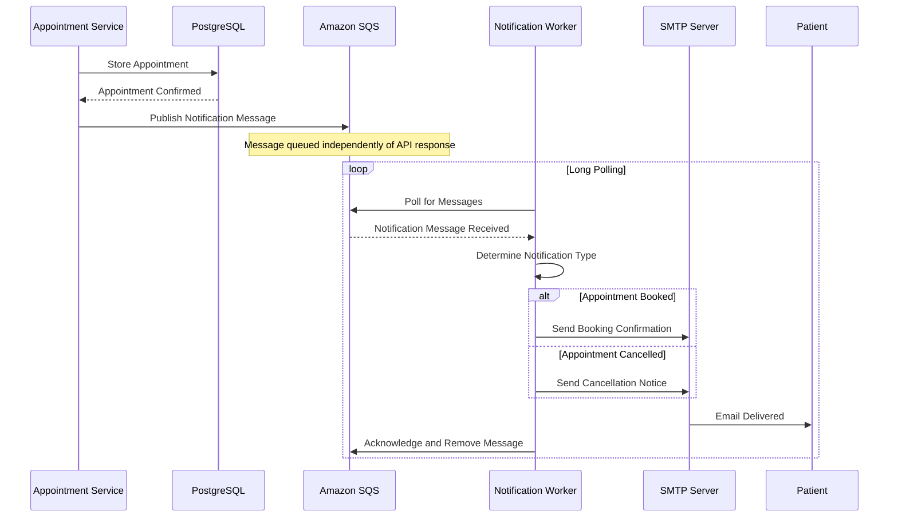

---

## 6. Doctor Availability Flow

An Admin defines when a Doctor is available. The system uses that availability record to generate predefined time slots. Receptionists can only book appointments against these predefined slots, which prevents double-booking at the data level.

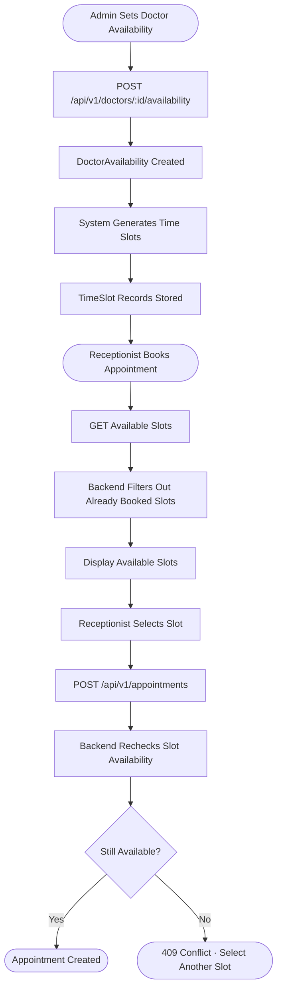

---

## 7. Soft Delete Flow

The system uses soft delete across all entities. Records are never permanently removed from the database. Instead, a `deleted_at` timestamp is set on the record. All standard queries automatically exclude soft-deleted records.

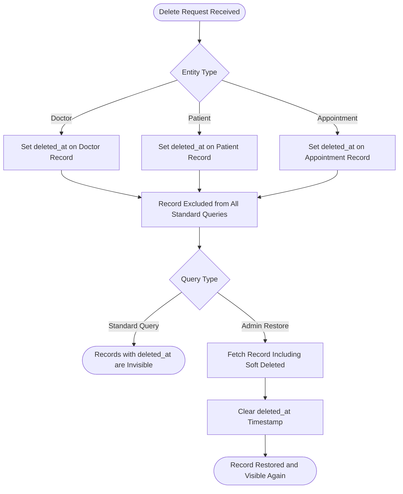

---

## 8. Authentication & RBAC Flow

Every protected request is validated in two stages. First, the JWT token is verified to confirm the user's identity. Second, the user's role is checked against the permitted roles for the requested route.

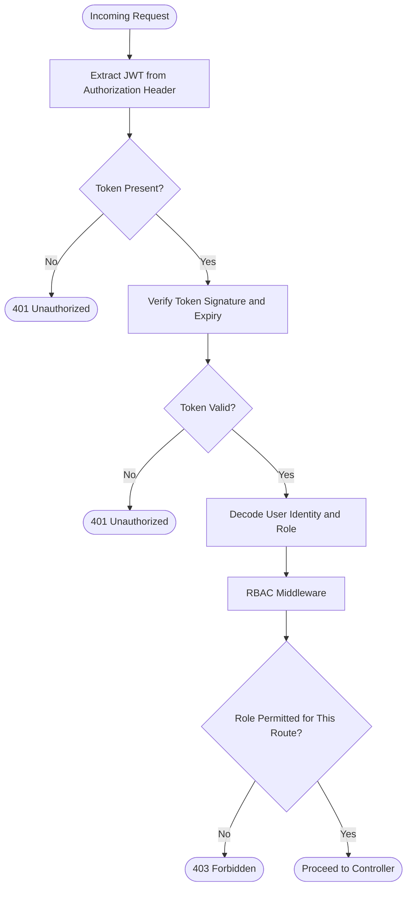

### RBAC Matrix

| Action | Admin | Receptionist | Doctor |
|---|---|---|---|
| Login | ✅ | ✅ | ✅ |
| Manage Doctors | ✅ | ❌ | ❌ |
| Set Doctor Availability | ✅ | ❌ | ❌ |
| Register Patients | ✅ | ✅ | ❌ |
| Book Appointment | ❌ | ✅ | ❌ |
| Reschedule Appointment | ❌ | ✅ | ❌ |
| Cancel Appointment | ❌ | ✅ | ❌ |
| View All Appointments | ✅ | ✅ | ❌ |
| View Own Appointments | ❌ | ❌ | ✅ |
| View Patient Details | ❌ | ❌ | ✅ |
| Add Consultation Notes | ❌ | ❌ | ✅ |
| Mark Appointment Completed | ❌ | ❌ | ✅ |
| View Dashboard | ✅ | ❌ | ❌ |

---

