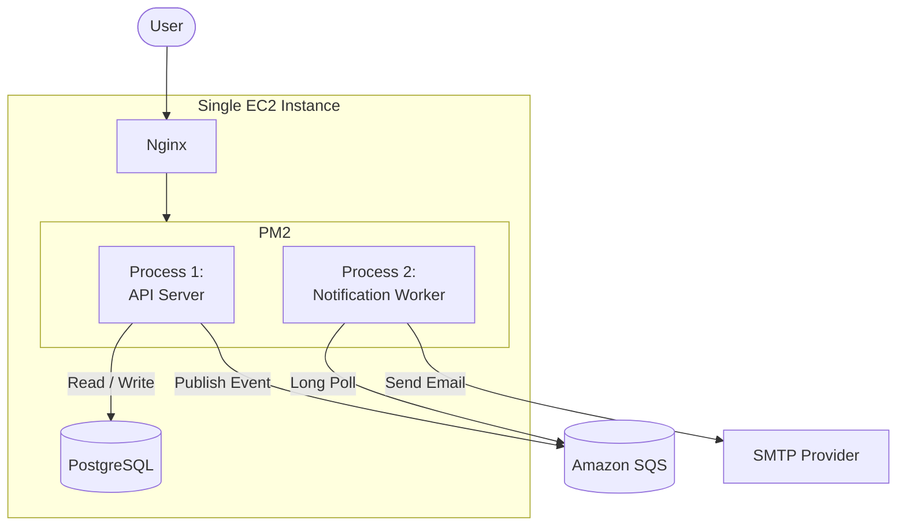
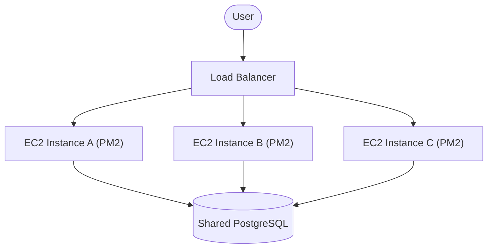
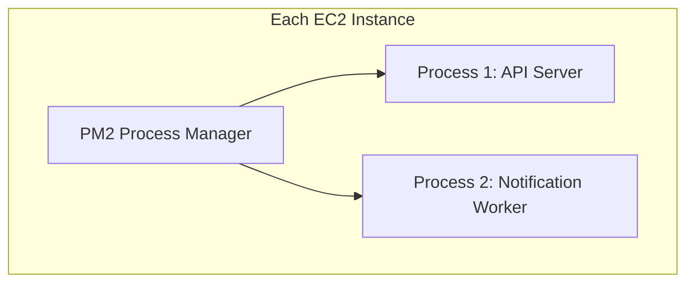
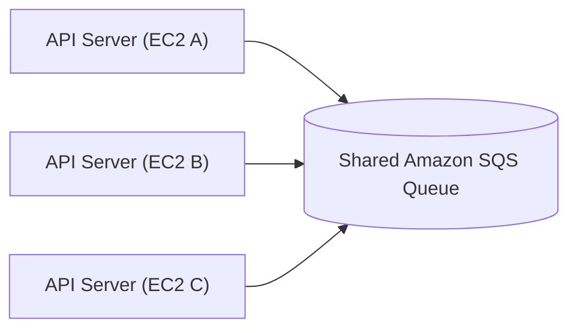
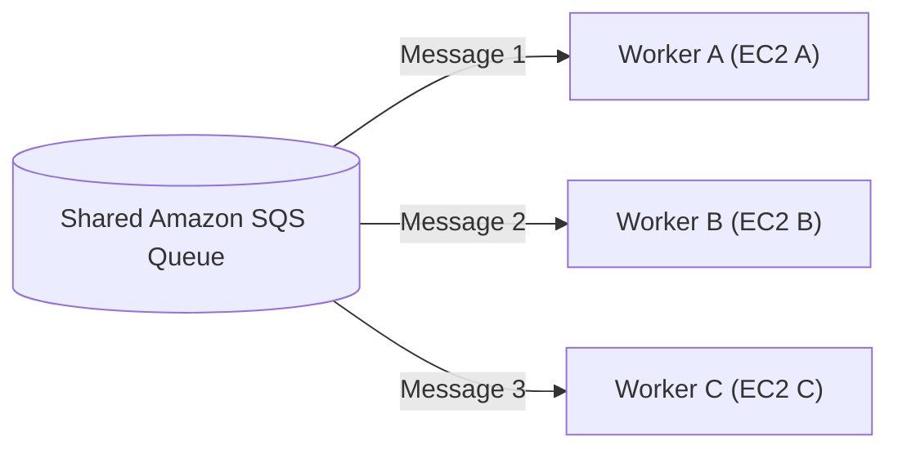
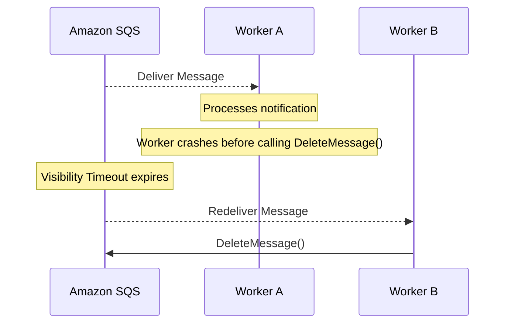
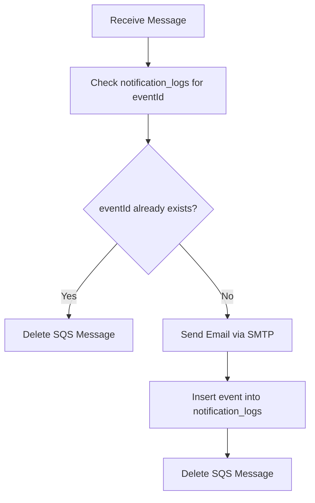
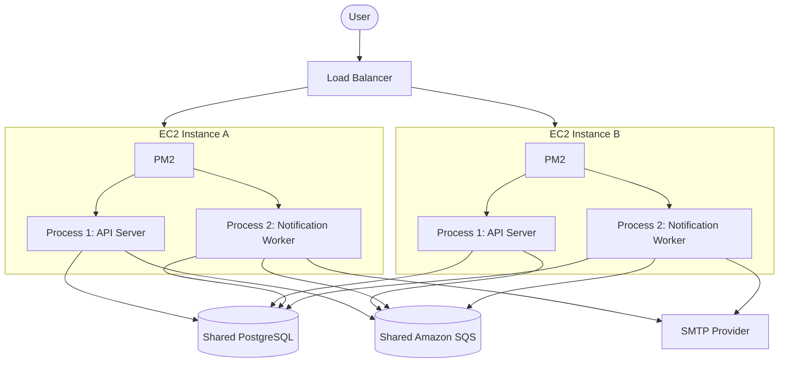

# Hospital Management System (HMS) — Scaling Architecture

## 1. Current Architecture

Today, the entire system runs on a **single EC2 instance**. PM2 manages two independent Node.js processes, and PostgreSQL runs locally on the same box.

**Limitation:** All components share one machine's CPU, memory, and network — API traffic, background worker load, and the database all compete for the same resources.

---

## 2. Horizontal Scaling

Instead of one EC2 instance, we deploy **multiple EC2 instances behind a Load Balancer**. Each instance runs the same PM2 process layout 

**Key point:** PostgreSQL remains a single shared instance; only the API/Worker layer scales horizontally.

---

## 3. PM2 Process Layout

On **every** EC2 instance, PM2 manages the same two processes as today. They are fully **independent** — one does not depend on the other's runtime state.

- **Process 1 (API Server):** handles HTTP requests from the Load Balancer.
- **Process 2 (Notification Worker):** long-polls SQS independently, regardless of API load.

---

## 4. Shared Amazon SQS

All API Server processes — across all EC2 instances — publish notification events into **one shared SQS queue**. There is no per-instance or per-EC2 queue.

**Why one shared queue:** it decouples notification production from consumption and lets any worker on any instance pick up any message — this is what enables the worker fleet to scale independently of the API fleet.

---

## 5. Message Distribution

Multiple Notification Workers, running on different EC2 instances, all long-poll the **same** shared queue. SQS distributes messages across the available workers.

SQS guarantees **At-Least-Once Delivery** — a message may occasionally be delivered more than once, but it will never be silently dropped.

---

## 6. Worker Failure

If a Notification Worker crashes after receiving a message but **before calling `DeleteMessage()`**, Amazon SQS does not remove the message from the queue. Instead, the message remains hidden for the duration of the **Visibility Timeout**. Once the timeout expires, the message becomes visible again and can be processed by another worker.

**Result:** The same notification may be delivered to another worker, potentially resulting in a duplicate email.

This behavior is expected because Amazon SQS provides **At-Least-Once Delivery**. The next section explains how **eventId-based idempotency** prevents duplicate notification processing.

---

## 7. Idempotent Notification Processing

Because SQS provides At-Least-Once Delivery, and multiple workers now poll the same queue, the **same notification event could be processed more than once**. To prevent duplicate emails, every event carries an `eventId`, and a new table tracks processed events.

### New Table: `notification_logs`

| Column           | Description                        |
|------------------|-------------------------------------|
| `id`             | Primary key                        |
| `event_id`       | Unique identifier from the event   |
| `event_type`     | Type of notification               |
| `recipient_email`| Target email address                |
| `status`         | Processing status                  |
| `processed_at`   | Timestamp of processing            |
| `created_at`     | Record creation timestamp          |

### Worker Processing Flow

This makes notification processing **idempotent**: regardless of how many times a message is redelivered, the recipient receives the email only once.

---

## 8. End-to-End Scaled Architecture

Combining all the above, this is the complete scaled HMS architecture.

**Summary of scaling changes:**

| Component            | Before             | After                                      |
|-----------------------|---------------------|---------------------------------------------|
| EC2                   | Single instance     | Multiple instances behind a Load Balancer   |
| API Server             | One process         | One process per EC2 instance                |
| Notification Worker    | One process         | One process per EC2 instance                |
| PostgreSQL             | Local, single       | Shared, single (unchanged)                  |
| Amazon SQS              | Single queue        | Same single shared queue (unchanged)        |
| Duplicate handling      | None                | `notification_logs` + `eventId` idempotency |

