# Hospital Management System
## Flow Design Document

**Project Type:** Backend Training Project
**Architecture:** Layered Monolith
**Stack:** Node.js · Express.js · PostgreSQL · Sequelize ORM · JWT · Amazon SQS
**Deployment:** AWS EC2 · PM2 · Nginx

---

## Table of Contents

1. [Business Flow Diagrams](#1-business-flow-diagrams)
2. [Sequence Diagrams](#2-sequence-diagrams)
3. [Request Lifecycle](#3-request-lifecycle)
4. [AWS Component Flow](#4-aws-component-flow)
5. [Notification Flow](#5-notification-flow)
6. [Doctor Availability Flow](#6-doctor-availability-flow)
7. [Soft Delete Flow](#7-soft-delete-flow)
8. [Authentication & RBAC Flow](#8-authentication--rbac-flow)
9. [Technology Justification](#9-technology-justification)
10. [Architecture Decision Records](#10-architecture-decision-records)
11. [Project Assumptions](#11-project-assumptions)
12. [Current Limitations](#12-current-limitations)

---

## 1. Business Flow Diagrams

### 1.1 Patient Registration & Appointment Booking

This flow describes how a Receptionist registers a new patient and books an appointment. The system checks whether the patient already exists before creating a new record. Once a slot is confirmed, the appointment is stored and a notification is dispatched asynchronously.

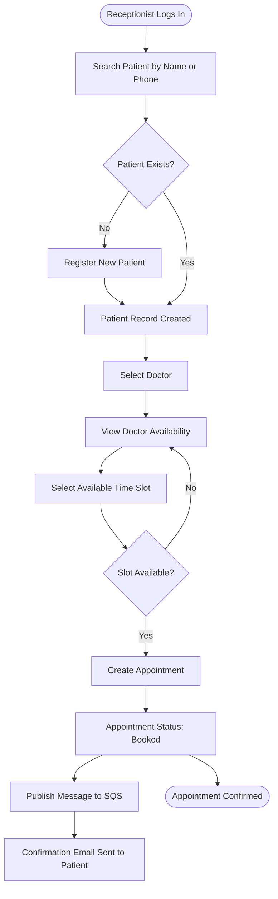

---

### 1.2 Doctor Consultation Flow

This flow describes how a Doctor views their assigned appointments, reviews patient details, records consultation notes, and marks the appointment as completed.

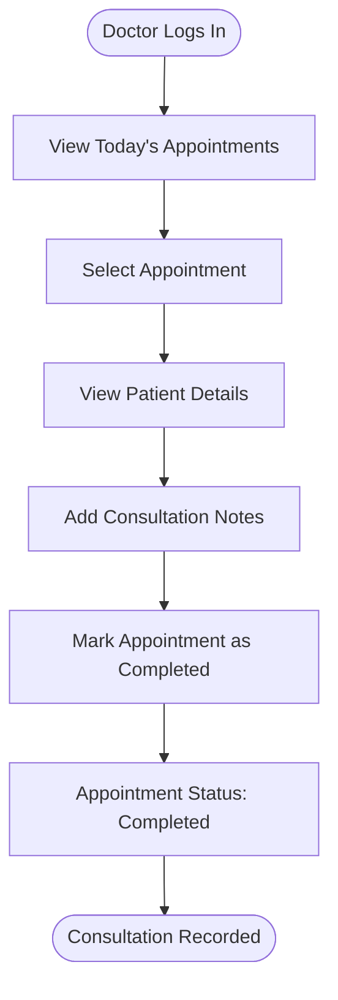

---

### 1.3 Appointment Cancellation Flow

This flow describes how a Receptionist cancels an existing appointment. The system enforces the business rule that only booked appointments can be cancelled. Cancelled and completed appointments cannot be modified.

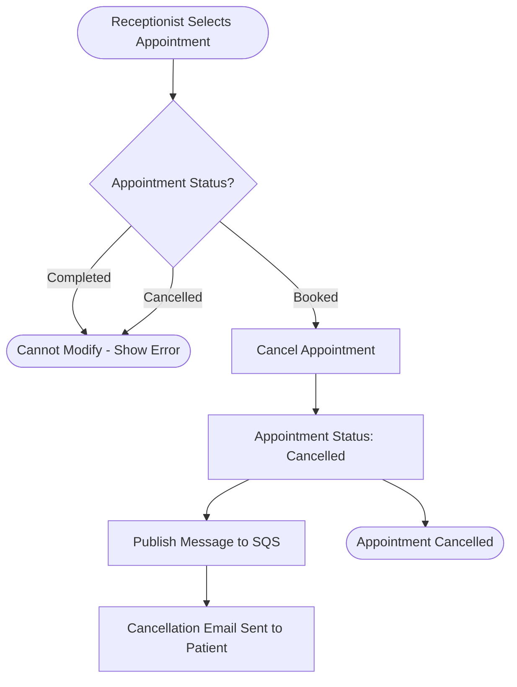

---

## 2. Sequence Diagrams

### 2.1 Authentication Sequence

This diagram shows the end-to-end flow of a user login request. The system validates credentials against the database, generates a JWT on success, and returns it to the client. The token is used for all subsequent authenticated requests.

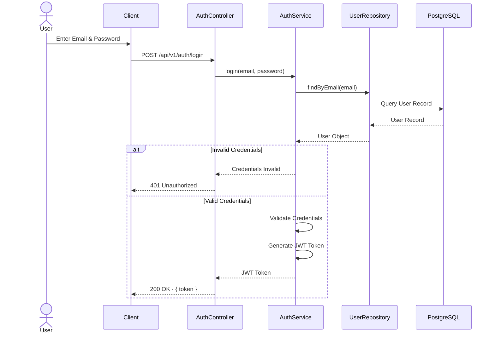

---

### 2.2 Appointment Booking Sequence

This diagram shows how a Receptionist books an appointment. The service layer checks for slot conflicts before persisting the appointment. On success, a message is published to SQS and the API response is returned immediately without waiting for the notification to be delivered.

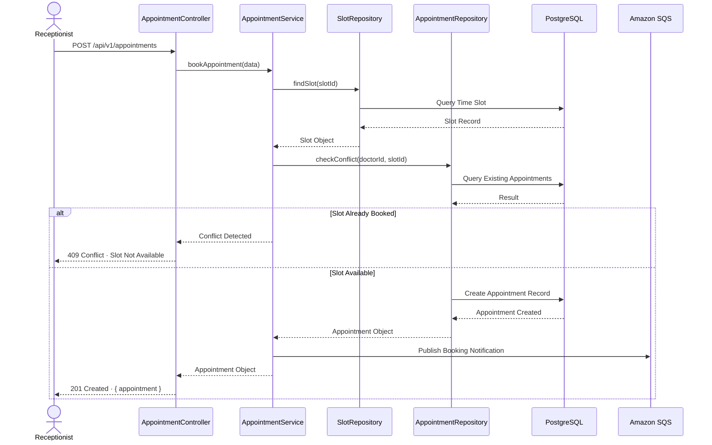

---

### 2.3 Doctor Views Appointments Sequence

This diagram shows how a Doctor retrieves their assigned appointments. The authentication middleware validates the JWT and attaches the user identity to the request before it reaches the controller.

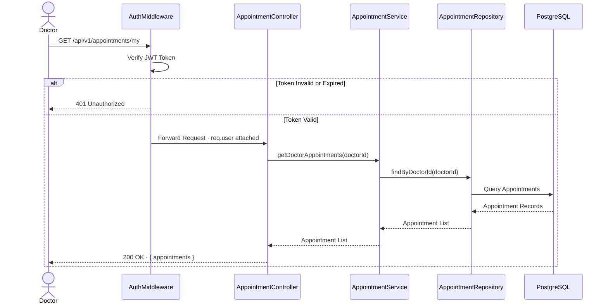

---

## 3. Request Lifecycle

Every API request passes through a consistent set of layers before reaching business logic. This ensures that authentication, authorization, and validation concerns are handled uniformly across all routes.

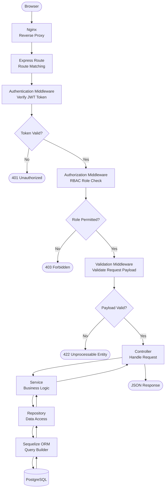

### Layer Responsibilities

| Layer | Responsibility |
|---|---|
| **Nginx** | Accepts incoming HTTP requests and forwards them to the Node.js application. Acts as a reverse proxy. |
| **Express Route** | Matches the incoming URL and HTTP method to the correct controller handler. |
| **Authentication Middleware** | Verifies the JWT token on every protected route. Attaches the decoded user identity to the request. |
| **Authorization Middleware** | Checks whether the authenticated user's role is permitted to access the requested route. |
| **Validation Middleware** | Validates the structure and content of the request body before it reaches business logic. |
| **Controller** | Receives the validated request, delegates to the service layer, and returns the formatted response. |
| **Service** | Contains all business logic. Enforces business rules such as slot conflict checks and status transitions. |
| **Repository** | Abstracts all database interactions. The service layer never queries the database directly. |
| **Sequelize ORM** | Translates repository calls into database queries. Handles soft delete filtering automatically. |
| **PostgreSQL** | Stores and retrieves all persistent data. |

---

## 4. AWS Component Flow

The system is deployed on a single AWS EC2 instance. Nginx acts as the entry point, PM2 manages the Node.js process, and Amazon SQS decouples notification delivery from the API response.

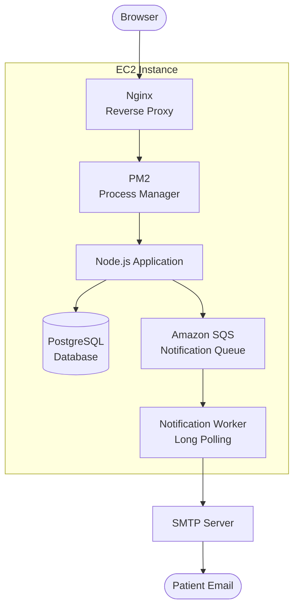

### Component Communication

| Component | Role | Why It Exists |
|---|---|---|
| **Nginx** | Receives all incoming HTTP requests and forwards them to the Node.js application. | Provides a stable entry point and isolates the application from direct internet exposure. |
| **PM2** | Manages the Node.js process. Restarts the application automatically if it crashes. | Ensures the application remains running without manual intervention. |
| **Node.js Application** | Handles all API requests, applies business logic, and interacts with the database. | The core of the system. All modules are served from this single process. |
| **PostgreSQL** | Stores all persistent data including users, doctors, patients, appointments, and time slots. | Runs on the same EC2 instance to keep the architecture simple for the current scope. |
| **Amazon SQS** | Receives notification messages published by the application after appointment events. | Decouples notification delivery from the API response. The application does not wait for the email to be sent before returning a response. |
| **Notification Worker** | A background process that polls SQS for messages and triggers email delivery. | Runs as a separate PM2-managed process on the same instance. |
| **SMTP Server** | Delivers the email to the patient. | Simple and cost-effective mechanism for sending transactional emails. |

---

## 5. Notification Flow

Notifications are sent asynchronously. The API response is returned to the client immediately after the appointment is stored. The notification is delivered independently through SQS and SMTP, ensuring that email delivery does not affect API performance or reliability.

```mermaid
sequenceDiagram
    participant AppService as Appointment Service
    participant DB as PostgreSQL
    participant SQS as Amazon SQS
    participant Worker as Notification Worker
    participant SMTP as SMTP Server
    participant Patient

    AppService->>DB: Store Appointment
    DB-->>AppService: Appointment Confirmed
    AppService->>SQS: Publish Notification Message
    Note over SQS: Message queued independently of API response

    loop Long Polling
        Worker->>SQS: Poll for Messages
        SQS-->>Worker: Notification Message Received
        Worker->>Worker: Determine Notification Type
        alt Appointment Booked
            Worker->>SMTP: Send Booking Confirmation
        else Appointment Cancelled
            Worker->>SMTP: Send Cancellation Notice
        end
        SMTP->>Patient: Email Delivered
        Worker->>SQS: Acknowledge and Remove Message
    end
```

### Why SQS Improves User Experience

Without SQS, the API would need to call the SMTP server directly before returning a response. If the SMTP server is slow or temporarily unavailable, the user would experience a delayed or failed response even though the appointment was successfully created.

By publishing to SQS first, the API responds immediately. The Notification Worker handles email delivery in the background. The user receives confirmation of their appointment without waiting for the email to be sent.

---

## 6. Doctor Availability Flow

An Admin defines when a Doctor is available. The system uses that availability record to generate predefined time slots. Receptionists can only book appointments against these predefined slots, which prevents double-booking at the data level.

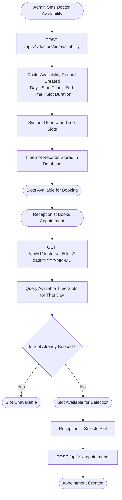

---

## 7. Soft Delete Flow

The system uses soft delete across all entities. Records are never permanently removed from the database. Instead, a `deleted_at` timestamp is set on the record. All standard queries automatically exclude soft-deleted records.

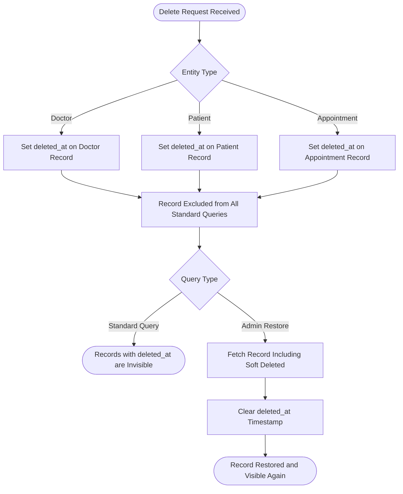

### Why Soft Delete

| Concern | Hard Delete | Soft Delete |
|---|---|---|
| Data Recovery | Not possible | Record can be restored |
| Historical Reference | Lost permanently | Preserved in database |
| Referential Integrity | Foreign key violations possible | All references remain intact |
| Future Audit Support | Requires separate audit table | Already available in existing tables |

---

## 8. Authentication & RBAC Flow

Every protected request is validated in two stages. First, the JWT token is verified to confirm the user's identity. Second, the user's role is checked against the permitted roles for the requested route.

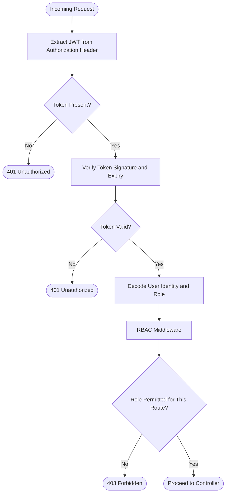

### RBAC Matrix

| Action | Admin | Receptionist | Doctor |
|---|---|---|---|
| Login | ✅ | ✅ | ✅ |
| Manage Doctors | ✅ | ❌ | ❌ |
| Set Doctor Availability | ✅ | ❌ | ❌ |
| Register Patients | ✅ | ✅ | ❌ |
| Book Appointment | ❌ | ✅ | ❌ |
| Reschedule Appointment | ❌ | ✅ | ❌ |
| Cancel Appointment | ❌ | ✅ | ❌ |
| View All Appointments | ✅ | ✅ | ❌ |
| View Own Appointments | ❌ | ❌ | ✅ |
| View Patient Details | ❌ | ❌ | ✅ |
| Add Consultation Notes | ❌ | ❌ | ✅ |
| Mark Appointment Completed | ❌ | ❌ | ✅ |
| View Dashboard | ✅ | ❌ | ❌ |

---

## 9. Technology Justification

| Technology | Decision | Purpose | Alternatives Considered |
|---|---|---|---|
| **Node.js** | Selected | Runtime for the backend application. Non-blocking I/O makes it well-suited for API-heavy systems. | Python/Django, Java/Spring |
| **Express.js** | Selected | Web framework for defining routes, middleware, and controllers. Minimal and unopinionated. | Fastify, NestJS |
| **PostgreSQL** | Selected | Relational database. Provides ACID compliance, referential integrity, and support for complex queries. | MySQL, MongoDB |
| **Sequelize ORM** | Selected | Abstracts database interactions. Supports migrations, model definitions, and paranoid soft delete. | TypeORM, Prisma, raw SQL |
| **JWT** | Selected | Stateless authentication. The user's identity and role are embedded in the token, eliminating the need for session storage. | Sessions, OAuth2 |
| **Amazon SQS** | Selected | Managed message queue. Decouples notification delivery from the API response. | RabbitMQ, Redis Pub/Sub, direct SMTP call |
| **SMTP** | Selected | Email delivery for appointment notifications. Simple and cost-effective for the current scope. | AWS SES, SendGrid |
| **PM2** | Selected | Process manager for Node.js. Keeps the application running and restarts it automatically on failure. | Forever, systemd |
| **Nginx** | Selected | Reverse proxy. Accepts incoming requests and forwards them to the Node.js application. | Apache, Caddy |
| **EC2 Single Instance** | Selected | Hosts the application, database, and worker process. Provides full control with minimal infrastructure complexity. | AWS ECS, Lambda, Elastic Beanstalk |
| **Soft Delete** | Selected | Preserves data history. Prevents accidental permanent data loss. Supports future audit requirements without schema changes. | Hard delete |
| **Layered Monolith** | Selected | Enforces separation of concerns across Controller, Service, Repository, and Model layers. Appropriate for the project scope and timeline. | Microservices, Serverless |
| **Validation Middleware** | Selected | Validates request payload structure and content before it reaches business logic. Keeps controllers and services clean. | Inline validation in controllers |

---

## 10. Architecture Decision Records

### ADR-001 · Layered Monolith over Microservices

**Status:** Accepted

**Context:**
The system must be designed and implemented within a two-week timeline by a single developer. The scope covers authentication, doctor management, patient management, appointment management, and consultation.

**Decision:**
Adopt a Layered Monolith with a clear separation between Controller, Service, Repository, and Model layers.

**Rationale:**
Microservices introduce deployment complexity, inter-service communication overhead, and distributed tracing requirements that are unnecessary at this scale. A monolith with well-defined layers enforces separation of concerns, is straightforward to develop and debug, and can be refactored into services in the future if required.

**Consequences:**
Individual modules cannot be scaled independently. This is acceptable for the current scope.

---

### ADR-002 · PostgreSQL on EC2 over AWS RDS

**Status:** Accepted

**Context:**
The system requires a relational database. AWS RDS is the managed alternative.

**Decision:**
Run PostgreSQL directly on the same EC2 instance as the application.

**Rationale:**
RDS introduces additional cost and infrastructure complexity that is not justified for a training project. A single EC2 instance with PostgreSQL is sufficient for the expected load. The schema is designed with a `hospital_id` foreign key to support migration to RDS and multi-hospital architecture in the future.

**Consequences:**
No automated backups or managed failover. Acceptable for the current scope. Migration to RDS is identified as a future improvement.

---

### ADR-003 · Amazon SQS for Asynchronous Notifications

**Status:** Accepted

**Context:**
Email notifications must be sent after appointment booking and cancellation. Sending email synchronously within the API request would couple notification delivery to the API response time.

**Decision:**
Publish a message to Amazon SQS after an appointment event. A separate Notification Worker consumes the queue using Long Polling and sends email via SMTP.

**Rationale:**
SQS decouples notification delivery from the API layer. The API responds immediately after storing the appointment. If email delivery fails, the message remains in the queue. SQS is a managed service that requires no additional infrastructure to operate.

**Consequences:**
Notifications are delivered asynchronously. There is a small delay between appointment confirmation and email receipt. This is acceptable for the use case.

---

### ADR-004 · Soft Delete over Hard Delete

**Status:** Accepted

**Context:**
Deleting doctors, patients, or appointments permanently removes data that may be needed for historical reference or future audit.

**Decision:**
Use Sequelize Paranoid mode. All delete operations set a `deleted_at` timestamp on the record instead of removing the row from the database.

**Rationale:**
Soft delete preserves data integrity and historical records. It prevents accidental permanent data loss. All standard queries automatically exclude soft-deleted records without requiring explicit filters in application code.

**Consequences:**
Database tables grow over time as deleted records are retained. Sequelize Paranoid handles query filtering automatically, so there is no additional burden on the application layer.

---

### ADR-005 · JWT for Authentication over Sessions

**Status:** Accepted

**Context:**
The system must authenticate three user roles — Admin, Receptionist, and Doctor — across all protected API endpoints.

**Decision:**
Use JWT tokens signed with a server-side secret. The user's identity and role are embedded in the token payload.

**Rationale:**
JWT is stateless. No session store is required. The user's role can be read directly from the token in the RBAC middleware without an additional database call per request. This simplifies the architecture and reduces database load.

**Consequences:**
Tokens cannot be invalidated before expiry without additional infrastructure. This is acceptable for the current scope.

---

### ADR-006 · TimeSlot as a Separate Table

**Status:** Accepted

**Context:**
Appointments must reference specific time slots. Slots could be stored as raw time strings on the appointment record or managed as a separate table.

**Decision:**
Maintain a `TimeSlots` table. Appointments reference a `slot_id` foreign key. Slots are generated from `DoctorAvailability` records.

**Rationale:**
A separate TimeSlot table allows a unique constraint on `(doctor_id, slot_id)` to enforce the no-double-booking rule at the database level. It also makes querying available slots straightforward and keeps the appointment record clean.

**Consequences:**
Time slots must be generated when a DoctorAvailability record is created. This is a small, well-defined operation with no significant complexity.

---

### ADR-007 · Multi-Hospital Schema from Day One

**Status:** Accepted

**Context:**
The current implementation serves a single hospital. Future scope may require supporting multiple hospitals.

**Decision:**
Include a `hospitals` table and a `hospital_id` foreign key on the `doctors` table from the initial schema.

**Rationale:**
Adding `hospital_id` after the initial implementation requires a migration and potential data backfill. Including it from the start costs nothing and ensures the schema is ready for multi-hospital support without structural changes.

**Consequences:**
The `hospitals` table will contain a single record in the current implementation. There is no functional impact on the current scope.

---

## 11. Project Assumptions

The following assumptions define the boundaries of the current design. They are directly derived from the Business Requirements Document and the decisions made during the design review.

| # | Assumption |
|---|---|
| 1 | One hospital is in scope for the current implementation. |
| 2 | All users — Admin, Receptionist, and Doctor — are created by the Admin. Self-registration is not supported. |
| 3 | A Doctor belongs to exactly one Hospital. |
| 4 | Time slots are predefined by the Admin based on Doctor Availability. Patients cannot request arbitrary appointment times. |
| 5 | A Doctor cannot have two appointments in the same time slot. This is enforced at the application and database level. |
| 6 | Appointments cannot be booked for past dates. |
| 7 | Cancelled appointments cannot be edited or rescheduled. |
| 8 | Email notifications are best-effort. A failed email delivery does not affect the appointment record. |
| 9 | The PostgreSQL database and the Node.js application run on the same EC2 instance. |
| 10 | Notifications are sent via SMTP. SMS notifications are out of scope for the current implementation. |

---

## 12. Current Limitations

The following limitations are acknowledged as part of the current design scope. They are not defects. They reflect deliberate decisions appropriate for a training project and are identified as areas for future improvement.

| Current Limitation | Future Improvement |
|---|---|
| Single hospital supported | Multi-hospital support |
| PostgreSQL hosted on EC2 | Migrate to AWS RDS |
| Email notifications only | Add SMS notifications |
| Single EC2 instance | Scalable infrastructure |
| Training project scope | Production hardening |

---

*This document is part of the Hospital Management System design package.*
*It should be read alongside the Architecture Design, Database Design, and API Design documents.*
